## Different aspects of the setup.

### Workflow paths

```mermaid
graph TD
    subgraph "Package Location & Mounting Strategy"
        A[Host Machine] --> |"Bind Mount<br>Real-time Sync"| B[".:/app"]
        
        subgraph "Container Architecture"
            B --> |"Working Space"| C["/app<br>Working Directory"]
            C --> |"Dependency Spec"| D["package.json"]
            C --> |"Version Lock"| E["pnpm-lock.yaml"]
            C --> |"Local Modules"| F["node_modules"]
            
            %% Critical path annotations
            classDef critical fill:#ff6b6b,color:white
            class E critical
            
            %% Performance notes
            note1["🚀 Fast local development<br>with host bind mount"]
            note2["🔒 Consistent dependencies<br>across environments"]
            A --- note1
            E --- note2
        end
        
        subgraph "Performance Optimization"
            G["PNPM Store<br>Global Cache<br>📦 Shared across projects"]
            H["PNPM Cache<br>Project Cache<br>⚡ Fast reinstalls"]
            
            %% Cache benefits
            note3["♻️ Reduces network calls<br>💾 Saves disk space"]
            G & H --- note3
        end
        
        F --> |"Reuse Packages"| G
        F --> |"Quick Access"| H
        
        style A fill:#97c2fc
        style C fill:#ff9999
        style G fill:#99ff99,stroke-width:3px
        style H fill:#99ff99,stroke-width:3px
    end
```





## Configuration 


## Container Setup Architecture

### Package Installation Strategy

Our setup implements a two-stage package installation approach:

1. **Build-time Installation** (Dockerfile)
```dockerfile
COPY --chown=node:node package.json ./
COPY --chown=node:node pnpm-lock.yaml* ./
RUN pnpm install
```
Purpose:
- Generates initial lock file if missing
- Creates cached Docker layer for faster rebuilds
- Ensures platform-specific compilation (linux/amd64)
- Pre-compiles critical dependencies

2. **Runtime Installation** (docker-compose.yml)
```yaml
command: sh -c "pnpm install && pnpm dev:host"
```
Purpose:
- Syncs dependencies with host-mounted changes
- Enables real-time development workflow
- Maintains development flexibility

### Volume Strategy

```yaml
volumes:
  - .:/app                                        # Source code
  - pnpm-store:/home/node/.local/share/pnpm/store # Global package cache
  - pnpm-cache:/home/node/.cache/pnpm             # Project-specific cache
```

This structure:
- Maintains fast package operations across container restarts
- Prevents unnecessary re-downloads
- Separates global cache from project-specific cache

### Development Modes

The `PNPM_FROZEN_LOCKFILE` flag controls dependency installation behavior:
- `false`: Flexible mode for local development (allows updates)
- `true`: Strict mode for CI/CD (enforces lock file)

### Security Considerations

- Non-root user (`node`) for container operations
- Platform-specific builds (`linux/amd64`)
- Proper file ownership (`--chown=node:node`)
- Isolated package caches

This architecture balances development speed, security, and consistency while maintaining proper caching and platform compatibility.
