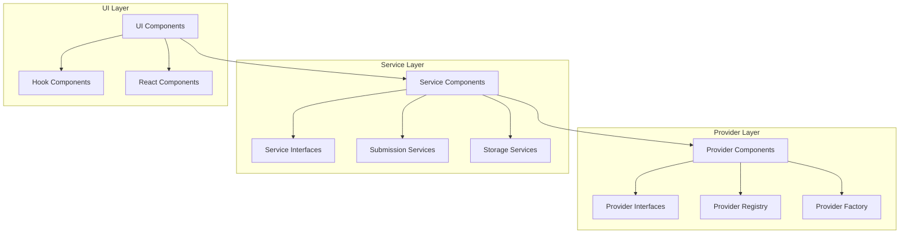

1. Conceptual View - High-level components and their relationships
2. Logical View - Classes, interfaces, and their interactions
3. Process View - Runtime behavior and communication
4. Physical View - Deployment and infrastructure
5. Development View - Code organization and module structure

Provider Component:
- AIProviderInterface
- AIProviderBase
- AnthropicProvider
- OpenAIProvider
- ProviderRegistry
- ProviderFactory

Submission Component:
- ChatSubmissionServiceInterface
- ChatSubmissionService
- StreamingSubmissionService

Storage Component:
- StorageServiceInterface
- StorageService

