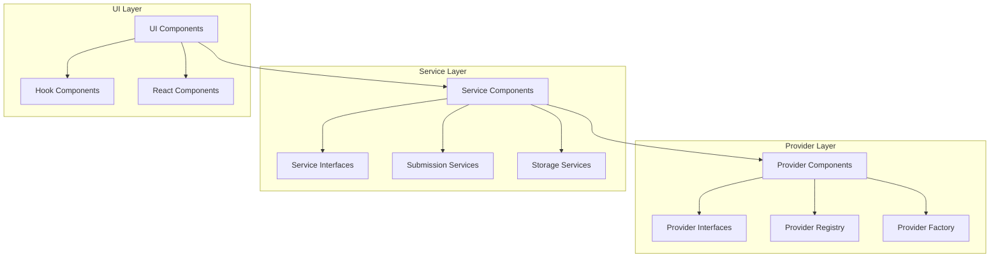

As an experienced software architect, you understand the challenge of managing complex architectures. Here's how architects work with large designs and how to effectively organize classes into components.

2. Conceptual View - High-level components and their relationships
2. Logical View - Classes, interfaces, and their interactions
3. Process View - Runtime behavior and communication
4. Physical View - Deployment and infrastructure
5. Development View - Code organization and module structure


## Organizing Classes into Components
Step 1: Identify Cohesive Groups
Look for classes that work together to fulfill a specific responsibility:
```
Provider Component:
- AIProviderInterface
- AIProviderBase
- AnthropicProvider
- OpenAIProvider
- ProviderRegistry
- ProviderFactory

Submission Component:
- ChatSubmissionServiceInterface
- ChatSubmissionService
- StreamingSubmissionService

Storage Component:
- StorageServiceInterface
- StorageService
```

## Create Architecture Decision Records (ADRs)
### ADR 1: Provider Registry Pattern

#### Context
We need a way to manage multiple AI providers with different APIs.

#### Decision
We will use a Provider Registry pattern to:
- Register provider implementations
- Retrieve providers by key
- Check for provider availability

#### Consequences
- Providers can be added without changing consumer code
- Testing is easier with mock providers
- We need to ensure providers implement the interface correctly


Practical Example: Converting Your Classes to Components
Let's convert part of your design into a component-based structure

Use barrel files to expose a clean API for each component:
```
// This file defines the public API of the Provider component

// Re-export the interfaces
export { AIProviderInterface } from './interfaces/AIProviderInterface';
export { ProviderCapabilities } from './interfaces/ProviderCapabilities';
export { ProviderKey } from './types/ProviderKey';

// Re-export the registry
export { ProviderRegistry } from './ProviderRegistry';

// Factory function (simpler than a class)
export function createProvider(key: ProviderKey): AIProviderInterface {
  return ProviderRegistry.getProvider(key);
}

// Hook that uses this component
export function useProvider(key: ProviderKey): AIProviderInterface {
  // Implementation that uses the component
  return createProvider(key);
}
```

Benefits of Component-Based Architecture
* Reduced Cognitive Load: You only need to understand one component at a time
* Better Encapsulation: Implementation details stay hidden
* Clearer Dependencies: Components explicitly declare what they depend on
* Easier Testing: Components can be tested in isolation
* Simpler Onboarding: New developers can understand one component at a time
* By organizing your classes into cohesive components with clear boundaries and well-defined interfaces, you'll make your architecture much easier to understand and maintain, even as it grows in complexity.


## Practical Techniques for Managing Complexity

### Package by Feature, Not by Layer

```
# Instead of this (by layer):
/models
  /User.ts
  /Chat.ts
/controllers
  /UserController.ts
  /ChatController.ts
/services
  /UserService.ts
  /ChatService.ts

# Do this (by feature):
/user
  /User.ts
  /UserController.ts
  /UserService.ts
/chat
  /Chat.ts
  /ChatController.ts
  /ChatService.ts
```
###  Use Bounded Contexts (from Domain-Driven Design)
```
src/
├── chat/                 # Chat Bounded Context
│   ├── domain/           # Domain models and logic
│   ├── application/      # Application services
│   ├── infrastructure/   # External dependencies
│   └── ui/               # UI components
├── providers/            # Provider Bounded Context
│   ├── domain/
│   ├── application/
│   └── infrastructure/
```

Provider Component:
- AIProviderInterface
- AIProviderBase
- AnthropicProvider
- OpenAIProvider
- ProviderRegistry
- ProviderFactory

Submission Component:
- ChatSubmissionServiceInterface
- ChatSubmissionService
- StreamingSubmissionService

Storage Component:
- StorageServiceInterface
- StorageService



