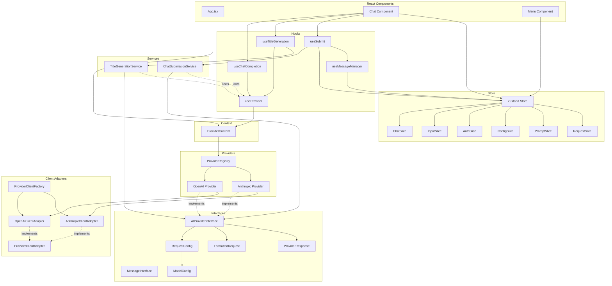
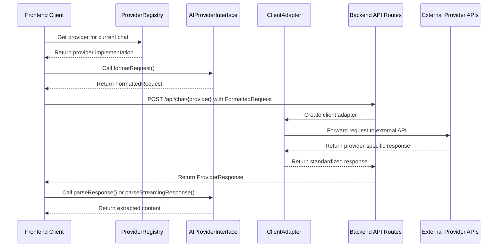
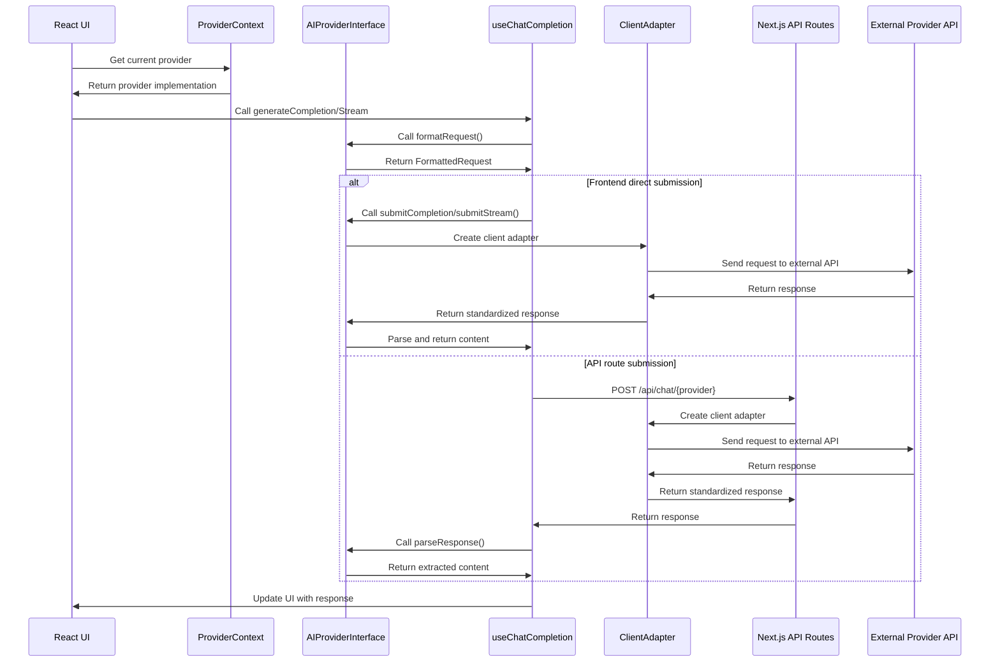

# Provider Architecture Interfaces

This document outlines the key interfaces in our provider architecture design, along with the motivation behind each interface based on SOLID principles and React patterns.



## Core Interfaces

### `AIProviderInterface` and `AIProviderBase`

The main interface and abstract base class that all AI providers must implement.

**Motivation:**
- **Single Responsibility Principle (SRP)**: Each provider implementation focuses solely on handling communication with a specific AI service.
- **Open/Closed Principle (OCP)**: New providers can be added without modifying existing code.
- **Interface Segregation Principle (ISP)**: The interface defines only the essential methods needed by all providers.
- **Dependency Inversion Principle (DIP)**: Components depend on abstractions (the interface) rather than concrete implementations.
- **React Context Pattern**: Enables dependency injection through React's context system.
- **Type Safety**: Uses abstract classes, readonly properties, and strict typing to prevent runtime errors.

### `ProviderClientAdapter` Interface

A new interface that defines the contract for provider-specific client adapters.

**Motivation:**
- **SRP**: Separates SDK interaction from provider business logic.
- **OCP**: New client adapters can be added without modifying existing code.
- **ISP**: Defines only the methods needed for API communication.
- **DIP**: Provider implementations depend on the adapter interface, not concrete implementations.
- **Adapter Pattern**: Provides a consistent interface over different provider SDKs.
- **Testability**: Makes it easier to mock API interactions for testing.

```typescript
export abstract class AIProviderBase {
  readonly id: ProviderKey;
  readonly name: string;
  readonly endpoints: ReadonlyArray<string>;
  readonly models: ReadonlyArray<string>;

  constructor(
    id: ProviderKey,
    name: string,
    endpoints: ReadonlyArray<string>,
    models: ReadonlyArray<string>
  ) {
    this.id = id;
    this.name = name;
    this.endpoints = endpoints;
    this.models = models;
  }

  /**
   * Converts application request format to provider-specific format
   * @param messages - Array of messages to send to the AI
   * @param config - Configuration for the request
   * @returns Formatted request ready to send to the provider's API
   */
  abstract formatRequest(
    messages: ReadonlyArray<MessageInterface>, 
    config: Readonly<RequestConfig>
  ): FormattedRequest;

  /**
   * Extracts content from a provider's non-streaming response
   * @param response - Raw response from the provider's API
   * @returns Extracted content as a string
   */
  abstract parseResponse(response: unknown): string;

  /**
   * Extracts content from a provider's streaming response chunk
   * @param response - Raw response chunk from the provider's API
   * @returns Extracted content as a string
   */
  abstract parseStreamingResponse(response: unknown): string;

  /**
   * Submits a completion request to the provider
   * @param formattedRequest - Request formatted for the provider's API
   * @returns Promise resolving to the provider's response
   */
  abstract submitCompletion(
    formattedRequest: Readonly<FormattedRequest>
  ): Promise<ProviderResponse>;

  /**
   * Submits a streaming request to the provider
   * @param formattedRequest - Request formatted for the provider's API
   * @returns Promise resolving to a ReadableStream of response chunks
   */
  abstract submitStream(
    formattedRequest: Readonly<FormattedRequest>
  ): Promise<ReadableStream>;
  
  /**
   * Validates that a response matches the expected format
   * @param response - Raw response from the provider's API
   * @throws TypeError if the response is invalid
   */
  protected validateResponse(response: unknown): asserts response is ProviderResponse {
    if (!response || typeof response !== 'object') {
      throw new TypeError('Invalid response format: response must be an object');
    }
  }
}
```

### `RequestConfig`

Configuration for AI requests, extending the base model config.

**Motivation:**
- **SRP**: Encapsulates all configuration parameters for a request.
- **OCP**: Extensible through optional fields for provider-specific features.
- **Composition over Inheritance**: Extends `ModelConfig` to reuse common configuration.
- **React Props Pattern**: Follows React's pattern of passing configuration as structured objects.
- **Immutability**: Uses readonly properties to prevent accidental mutation.

```typescript
export interface RequestConfig extends BaseModelConfig {
  /**
   * Whether to stream the response (true) or receive it all at once (false)
   * Optional in incoming config, defaults to false
   */
  readonly stream?: boolean;

  /**
   * Configuration for thinking mode, which allows the AI to "think" before responding
   * This enables more thoughtful and comprehensive responses by allocating tokens for reasoning
   */
  readonly thinking?: Readonly<{
    /**
     * Whether thinking mode is enabled for this request
     */
    readonly enabled: boolean;

    /**
     * Maximum number of tokens to allocate for thinking
     * Higher values allow for more complex reasoning but consume more tokens
     */
    readonly budget_tokens: number;
  }>;
}
```

### `FormattedRequest`

The standardized request format that providers convert to their specific API format.

**Motivation:**
- **SRP**: Represents the standardized request format across providers.
- **Liskov Substitution Principle (LSP)**: All provider-specific request formats can be derived from this base structure.
- **OCP**: Extensible through the index signature for provider-specific fields.
- **Information Hiding**: Abstracts provider-specific request details from components.
- **Type Safety**: Uses discriminated unions and readonly properties.

```typescript
export interface FormattedRequest {
  /**
   * Array of messages in provider-specific format
   * Each provider may have different message structure requirements
   */
  readonly messages: readonly unknown[];

  /**
   * Model identifier to use for this request (e.g., "gpt-4o", "claude-3-7-sonnet")
   */
  readonly model: string;

  /**
   * Maximum number of tokens to generate in the response
   */
  readonly max_tokens: number;

  /**
   * Controls randomness: 0 = deterministic, 1 = maximum randomness
   * Lower values make output more focused and deterministic
   * Higher values introduce more randomness and creativity
   */
  readonly temperature: number;

  /**
   * Controls diversity via nucleus sampling
   * 0.1 = only consider tokens in the top 10% probability mass
   * 1.0 = consider all tokens (equivalent to no nucleus sampling)
   */
  readonly top_p: number;

  /**
   * Whether to stream the response (true) or receive it all at once (false)
   */
  readonly stream: boolean;

  /**
   * Thinking configuration for providers that support it (e.g., Anthropic)
   * Enables the AI to reason through complex problems before responding
   */
  readonly thinking?: {
    /**
     * Type of thinking mode
     * - "enabled": AI will use thinking capabilities
     * - "disabled": AI will not use thinking capabilities
     */
    readonly type: 'enabled' | 'disabled';

    /**
     * Maximum number of tokens to allocate for thinking
     * Higher values allow for more complex reasoning but consume more tokens
     */
    readonly budget_tokens: number;
  };

  /**
   * System message for providers that support it separately from messages
   * (e.g., Anthropic treats system messages differently)
   */
  readonly system?: string;

  /**
   * Reduces repetition of the same tokens
   * Higher values decrease likelihood of repeating the same phrases
   * Optional, as not all providers support this
   */
  readonly presence_penalty?: number;

  /**
   * Reduces repetition of the same topics
   * Higher values decrease likelihood of discussing the same topics
   * Optional, as not all providers support this
   */
  readonly frequency_penalty?: number;

  /**
   * Allow additional provider-specific fields
   * Enables extensibility for provider-specific parameters
   */
  readonly [key: string]: unknown;
}
```

### `ProviderResponse`

A standardized response format that providers convert their API responses to.

**Motivation:**
- **SRP**: Standardizes response formats across different providers.
- **LSP**: All provider-specific responses can be mapped to this common structure.
- **OCP**: Extensible through the index signature for provider-specific fields.
- **Adapter Pattern**: Acts as an adapter between provider-specific responses and application-wide format.
- **Type Safety**: Uses discriminated unions for different response formats.

```typescript
export type ProviderResponse = 
  | { type?: string; content: string; [key: string]: unknown }
  | { type?: string; content: ReadonlyArray<{readonly text: string}>; [key: string]: unknown }
  | { type?: string; choices: ReadonlyArray<{
      readonly message?: { readonly content?: string };
      readonly delta?: { readonly content?: string };
    }>; [key: string]: unknown }
  | { type: 'content_block_delta'; delta: { 
      readonly text?: string;
      readonly [key: string]: unknown;
    }; [key: string]: unknown };
```

### `MessageInterface`

Represents a message in a conversation.

**Motivation:**
- **SRP**: Encapsulates the structure of a single message.
- **Common Data Structure**: Provides a consistent format for messages across the application.
- **Data Transfer Object Pattern**: Acts as a pure data container for message information.

```typescript
export interface MessageInterface {
    /**
     * Role of the message sender
     * - system: Instructions or context for the AI
     * - user: Messages from the human user
     * - assistant: Messages from the AI assistant
     */
    role: 'system' | 'user' | 'assistant';

    /**
     * Content of the message
     */
    content: string;

    /**
     * Optional unique identifier for the message
     */
    id?: string;

    /**
     * Optional timestamp when the message was created
     * Stored as milliseconds since epoch
     */
    timestamp?: number;
}
```

### `ModelConfig`

Base configuration for AI models.

**Motivation:**
- **SRP**: Centralizes model-specific configuration parameters.
- **Separation of Concerns**: Separates model configuration from provider configuration.
- **Configuration Object Pattern**: Follows the pattern of grouping related configuration parameters.

```typescript
export interface ModelConfig {
    /**
     * Model identifier to use (e.g., "gpt-4o", "claude-3-7-sonnet")
     */
    model: string;

    /**
     * Controls randomness: 0 = deterministic, 1 = maximum randomness
     * Lower values make output more focused and deterministic
     * Higher values introduce more randomness and creativity
     */
    temperature: number;

    /**
     * Controls diversity via nucleus sampling
     * 0.1 = only consider tokens comprising the top 10% probability mass
     * 1.0 = consider all tokens (but still weighted by probability)
     */
    top_p?: number;

    /**
     * Maximum number of tokens to generate in the response
     */
    max_tokens: number;

    /**
     * Reduces repetition of the same tokens
     * Higher values decrease likelihood of repeating the same phrases
     * Optional, as not all providers support this
     */
    presence_penalty?: number;

    /**
     * Reduces repetition of the same topics
     * Higher values decrease likelihood of discussing the same topics
     * Optional, as not all providers support this
     */
    frequency_penalty?: number;

    /**
     * Whether thinking capability is enabled for this model
     * Thinking allows the AI to reason through complex problems before responding
     */
    thinking_mode?: {
    /**
         * Whether thinking is enabled
     */
        enabled: boolean;

        /**
         * Maximum number of tokens to allocate for thinking
         * Higher values allow for more complex reasoning but consume more tokens
         */
        budget_tokens: number;
    };
}
```

## Provider Registry Types

### `ProviderKey`

Type for supported providers.

**Motivation:**
- **Type Safety**: Ensures provider keys are valid throughout the application.
- **Extensibility**: Allows for adding new providers while maintaining type safety.

```typescript
/**
 * Identifier for supported AI providers
 * - 'openai': OpenAI API (GPT models)
 * - 'anthropic': Anthropic API (Claude models)
 * - string: Allows for future provider extensions
 */
export type ProviderKey = 'openai' | 'anthropic' | string;
```

### `ProviderConfig`

Configuration for a provider in the registry.

**Motivation:**
- **SRP**: Centralizes provider configuration management.
- **OCP**: New providers can be added by extending the registry.
- **DIP**: Components depend on the registry abstraction rather than specific providers.
- **Factory Pattern**: The registry acts as a factory for provider instances.
- **React Configuration Pattern**: Follows React's pattern of centralized configuration.

```typescript
export interface ProviderConfig {
    /**
     * Display name of the provider
     */
    name: string;

    /**
     * List of API endpoints this provider can use
     */
    endpoints: string[];

    /**
     * List of model IDs supported by this provider
         */
    models: string[];

        /**
     * Optional default model to use for this provider
         */
    defaultModel?: string;

        /**
     * Optional configuration for provider-specific features
                 */
    features?: {
                /**
         * Whether this provider supports thinking mode
                 */
        supportsThinking?: boolean;

            /**
         * Whether this provider supports streaming responses
                 */
        supportsStreaming?: boolean;

                /**
         * Additional provider-specific feature flags
                 */
        [key: string]: boolean | undefined;
            };
        }
```

## Hook Return Types

### `UseTitleGenerationReturn`

Return type for the useTitleGeneration hook.

**Motivation:**
- **SRP**: The hook has a single, focused responsibility.
- **ISP**: Hook interface exposes only the methods needed by consumers.
- **React Hooks Pattern**: Follows React's pattern of encapsulating logic in hooks.
- **Command Pattern**: Each method represents a specific command operation.

```typescript
export interface UseTitleGenerationReturn {
    /**
     * Generates a title for a chat based on its messages
     *
     * @param messages - Array of messages in the chat
     * @param config - Model configuration to use for title generation
     * @param chatIndex - Optional index of the chat to update (defaults to current chat)
     * @returns Promise that resolves when title generation is complete
     *
     * The function will:
     * 1. Check if the chat already has a title
     * 2. Create a special prompt for title generation
     * 3. Submit the request to the AI provider
     * 4. Update the chat with the generated title
     */
    generateTitle: (
        messages: MessageInterface[],
        config: ModelConfig,
        chatIndex?: number
    ) => Promise<void>;
}
```

### `UseChatCompletionReturn`

Return type for the useChatCompletion hook.

**Motivation:**
- **SRP**: The hook has a single, focused responsibility.
- **ISP**: Hook interface exposes only the methods needed by consumers.
- **React Hooks Pattern**: Follows React's pattern of encapsulating logic in hooks.
- **Facade Pattern**: Provides a simplified interface to the underlying provider complexity.

```typescript
export interface UseChatCompletionReturn {
    /**
     * Generates a completion for a chat conversation
     *
     * @param messages - Array of messages in the conversation
     * @param config - Model configuration to use for completion
     * @returns Promise resolving to the generated completion text
     *
     * This method handles the entire completion process:
     * 1. Formatting the request for the provider
     * 2. Submitting the request
     * 3. Parsing the response
     */
    generateCompletion: (
        messages: MessageInterface[],
        config: ModelConfig
    ) => Promise<string>;

    /**
     * Generates a streaming completion for a chat conversation
     *
     * @param messages - Array of messages in the conversation
     * @param config - Model configuration to use for completion
     * @param onChunk - Callback function that receives each chunk of the response
     * @returns Promise that resolves when the stream is complete
     *
     * This method handles the streaming completion process:
     * 1. Formatting the request for the provider with streaming enabled
     * 2. Submitting the streaming request
     * 3. Processing each chunk and calling the onChunk callback
     */
    generateCompletionStream: (
        messages: MessageInterface[],
        config: ModelConfig,
        onChunk: (chunk: string) => void
    ) => Promise<void>;
}
```

## API Contracts

### Frontend-Backend Communication

The communication between the frontend and backend follows a standardized contract pattern to ensure consistency, security, and maintainability.



**Motivation:**
- **Security**: API keys are never exposed to the client, only stored and used on the server
- **Standardization**: Consistent request and response formats across different providers
- **Separation of Concerns**: Each component has a clear, focused responsibility
- **Maintainability**: Changes to provider APIs only require updates in one place
- **Extensibility**: New providers can be added with minimal changes to the architecture

### Request Contract

When the frontend makes a request to the backend, it follows this standardized format:

```typescript
// POST /api/chat/{provider}
{
  "formattedRequest": {
    "model": "gpt-4o",
    "max_tokens": 4096,
    "temperature": 0.7,
    "messages": [
      { "role": "system", "content": "You are a helpful assistant." },
      { "role": "user", "content": "Hello, world!" }
    ],
    "stream": false
  },
  "apiKey": "sk-..." // Only sent to backend, never exposed in frontend
}
```

**Motivation:**
- **Single Responsibility Principle (SRP)**: The frontend is responsible only for formatting the request according to the provider's requirements, while the backend is responsible for securely communicating with the external API.
- **Dependency Inversion Principle (DIP)**: Both frontend and backend depend on the shared `FormattedRequest` interface rather than specific implementation details.
- **Information Hiding**: The details of how requests are formatted are encapsulated within the provider implementation.
- **Consistency**: All providers use the same request structure, making the code more maintainable.

### Response Contract

The backend returns responses in a standardized format that matches the `ProviderResponse` interface:

```typescript
// Response from /api/chat/{provider}
{
  "id": "chatcmpl-123",
  "object": "chat.completion",
  "created": 1677858242,
  "model": "gpt-4o",
  "choices": [
    {
      "message": {
        "role": "assistant",
        "content": "Hello! How can I help you today?"
      },
      "finish_reason": "stop",
      "index": 0
    }
  ],
  // Provider-specific fields may be included
}
```

**Motivation:**
- **Adapter Pattern**: The backend acts as an adapter between provider-specific response formats and the standardized format used by the application.
- **Liskov Substitution Principle (LSP)**: All provider responses can be treated uniformly by the frontend.
- **Open/Closed Principle (OCP)**: The response format is extensible through the index signature for provider-specific fields.
- **Abstraction**: The frontend doesn't need to know the details of each provider's response format.

### Streaming Response Contract

For streaming responses, the backend uses Server-Sent Events (SSE) with a standardized event format:

```
data: {"type":"content_block_delta","delta":{"text":"Hello"}}

data: {"type":"content_block_delta","delta":{"text":" world"}}

data: [DONE]
```

**Motivation:**
- **Real-time Updates**: Allows for incremental updates to the UI as responses are generated.
- **Efficiency**: Reduces perceived latency by showing partial responses immediately.
- **Standardization**: Uses the well-established SSE protocol for streaming data.
- **Compatibility**: Works across all modern browsers and with server frameworks.


## Implementation Guidelines

### Backend Route Handlers

Backend route handlers should:

1. Accept POST requests with the standardized request body
2. Extract the `formattedRequest` and `apiKey` from the request
3. Initialize the appropriate client adapter using `ProviderClientFactory`
4. Forward the request to the external API through the client adapter
5. Format the response according to the standardized response contract
6. Handle errors and return appropriate error responses

### Frontend Provider Implementations

Frontend provider implementations should:

1. Implement the `AIProviderInterface`
2. Format requests using the `formatRequest` method
3. Use client adapters for API communication via `submitCompletion` and `submitStream` methods
4. Parse responses using the `parseResponse` or `parseStreamingResponse` methods
5. Handle errors and provide meaningful error messages

## Client Adapter Pattern Benefits

The new Client Adapter pattern provides several key benefits:

1. **Separation of Concerns**: 
   - Provider implementations focus on business logic
   - Client adapters focus on SDK interaction
   - API routes focus on HTTP handling

2. **Code Reuse**:
   - Same client adapters used in both development and production
   - Consistent request/response handling across environments

3. **Testability**:
   - Client adapters can be easily mocked
   - Provider implementations can be tested in isolation

4. **Maintainability**:
   - SDK upgrades only require changes to client adapters
   - Provider-specific logic is centralized

5. **Extensibility**:
   - New providers can be added by implementing a new client adapter
   - Existing code remains unchanged

## Sequence Diagram for Client Adapter Pattern



## Client Adapter Implementation

### `ProviderClientFactory`

Factory for creating provider client adapters.

**Motivation:**
- **Factory Pattern**: Centralizes creation of client adapters.
- **SRP**: Responsible only for creating the appropriate client adapter.
- **OCP**: New providers can be added by extending the factory.
- **DIP**: Clients depend on the adapter interface, not concrete implementations.

### `AnthropicClientAdapter` and `OpenAIClientAdapter`

Concrete implementations of the `ProviderClientAdapter` interface.

**Motivation:**
- **SRP**: Each adapter is responsible only for communicating with a specific AI service.
- **Encapsulation**: Hides the details of SDK initialization and request formatting.
- **Adapter Pattern**: Provides a consistent interface over different provider SDKs.
- **Testability**: Makes it easier to mock provider interactions for testing.

## Client Wrappers and Server Script

### `AnthropicClient` and `OpenAIClient`

These client wrapper classes encapsulate the provider SDK interactions:

**Motivation:**
- **SRP**: Each client focuses solely on communicating with a specific AI service
- **Encapsulation**: Hides the details of SDK initialization and request formatting
- **Adapter Pattern**: Provides a consistent interface over different provider SDKs
- **Testability**: Makes it easier to mock provider interactions for testing

```typescript
// src/api/anthropic-client.js
export class AnthropicClient {
  constructor(apiKey, requestId) {
    this.client = new Anthropic({ apiKey });
    this.requestId = requestId;
  }
  
  async createStreamingMessage(params) {
    const formattedParams = this._formatParams(params);
    return await this.client.messages.create({
      ...formattedParams,
      stream: true
    });
  }
  
  async createMessage(params) {
    const formattedParams = this._formatParams(params);
    return await this.client.messages.create({
      ...formattedParams,
      stream: false
    });
  }
  
  _formatParams(params) {
    // Convert generic params to Anthropic-specific format
    return {
      model: params.model || 'claude-3-7-sonnet-20250219',
      max_tokens: params.max_tokens || 4096,
      temperature: params.temperature || 0.7,
      messages: params.messages,
      system: params.system
    };
  }
}

// src/api/openai-client.js
export class OpenAIClient {
  constructor(apiKey, requestId) {
    this.client = new OpenAI({ apiKey });
    this.requestId = requestId;
  }
  
  async createStreamingMessage(params) {
    const formattedParams = this._formatParams(params);
    return await this.client.chat.completions.create({
      ...formattedParams,
      stream: true
    });
  }
  
  async createMessage(params) {
    const formattedParams = this._formatParams(params);
    return await this.client.chat.completions.create({
      ...formattedParams,
      stream: false
    });
  }
  
  _formatParams(params) {
    // Convert generic params to OpenAI-specific format
    return {
      model: params.model || 'gpt-4o',
      max_tokens: params.max_tokens || 4096,
      temperature: params.temperature || 0.7,
      messages: params.messages
    };
  }
}
```

### Express Server Script

The `scripts/server.js` file implements an Express server that:

```typescript
// scripts/server.js (simplified)
import express from 'express';
import { AnthropicClient } from '../src/api/anthropic-client.js';
import { OpenAIClient } from '../src/api/openai-client.js';

const app = express();
app.use(express.json());

// Anthropic endpoint
app.post('/api/anthropic', async (req, res) => {
  const { messages, config, apiKey } = req.body;
  const isStreaming = config?.stream === true;
  const requestId = req.headers['x-request-id'] || uuidv4();
  
  try {
    // Initialize client wrapper
    const anthropicClient = new AnthropicClient(apiKey, requestId);
    
    // Create request parameters
    const requestParams = {
      model: config.model || 'claude-3-7-sonnet-20250219',
      max_tokens: config.max_tokens || 4096,
      temperature: config.temperature || 0.7,
      messages: messages,
      system: config.system
    };
    
    if (isStreaming) {
      // Handle streaming response
      res.setHeader('Content-Type', 'text/event-stream');
      res.setHeader('Cache-Control', 'no-cache');
      res.setHeader('Connection', 'keep-alive');
      
      const stream = await anthropicClient.createStreamingMessage(requestParams);
      
      // Process stream chunks
      for await (const chunk of stream) {
        res.write(`data: ${JSON.stringify(chunk)}\n\n`);
      }
      
      res.write('data: [DONE]\n\n');
      res.end();
    } else {
      // Handle non-streaming response
      const response = await anthropicClient.createMessage(requestParams);
      res.json(response);
    }
  } catch (error) {
    console.error('API error:', error);
    res.status(500).json({ error: error.message });
  }
});

// OpenAI endpoint (similar structure)
app.post('/api/openai', async (req, res) => {
  // Similar implementation to the Anthropic endpoint
});

app.listen(3000, () => {
  console.log('Server running on port 3000');
});
```

## Development vs Production Configuration

The application uses Vite's configuration to handle different environments:

```typescript
// vite.config.ts
function createDevConfig(): UserConfig {
  return {
    server: {
      // ...other config
      proxy: {
        '/api': {
          target: 'http://127.0.0.1:3000',
          changeOrigin: true,
          secure: false,
          ws: true,
          // ...proxy configuration
        }
      }
    }
  };
}
```

In development mode, API requests are proxied to the local Express server running on port 3000. In production, the Next.js API routes handle the requests directly.

## Implementation Choices

The dual implementation approach provides several benefits:

1. **Development Experience**: The Express server provides a fast, hot-reloadable development environment
2. **Production Scalability**: Next.js API routes offer serverless deployment options
3. **Flexibility**: The same frontend code works with either backend implementation
4. **Security**: Both implementations keep API keys server-side only

This architecture maintains the provider abstraction layer while allowing for different backend implementations, all following the same interface contracts.
