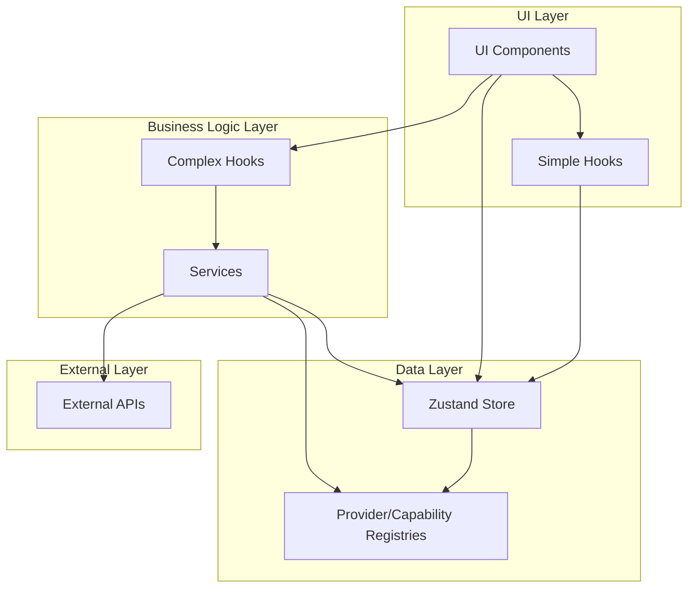
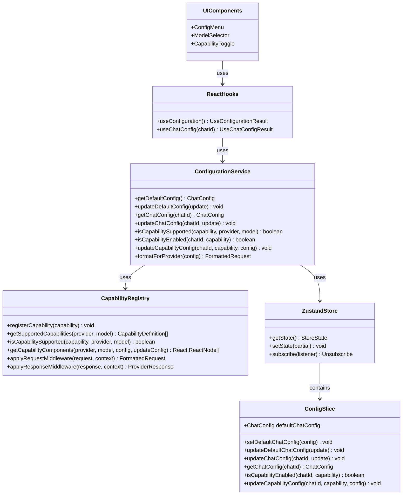

# Balanced Provider Architecture

This document outlines a balanced approach to our provider architecture, combining SOLID principles with pragmatic implementation concerns.

## Core Architecture Principles

1. **Simplicity for Common Cases**:
   - Direct access patterns for frequent operations
   - Simplified hooks for common UI needs
   - Sensible defaults that work out-of-the-box

2. **Extensibility for Complex Cases**:
   - Full middleware pipeline for advanced scenarios
   - Registry patterns for adding new providers/capabilities
   - Service abstractions for complex business logic

3. **Performance by Default**:
   - Selective store subscriptions to minimize re-renders
   - Memoization of expensive computations
   - Lazy initialization of heavy resources

4. **Developer Experience**:
   - Consistent error handling and validation
   - Clear documentation of patterns and contracts
   - Type safety without excessive verbosity

## Simplified Architecture Diagram



## Balanced API Contracts

### Store Design

The store follows a slice pattern with direct selectors for common operations:

```typescript
// Store creation with slices
const useStore = create<StoreState>()(
  persist(
    (...a) => ({
      ...createChatSlice(...a),
      ...createConfigSlice(...a),
      ...createAuthSlice(...a),
      // Other slices
    }),
    {
      name: 'chat-store',
      partialize: (state) => ({
        // Only persist necessary state
        chats: state.chats,
        defaultChatConfig: state.defaultChatConfig,
        // Other persisted state
      })
    }
  )
);

// Direct selectors for common operations
export const useCurrentChat = () => useStore(state => {
  const { chats, currentChatIndex } = state;
  return chats[currentChatIndex];
});

export const useCurrentChatConfig = () => useStore(state => {
  const { chats, currentChatIndex } = state;
  return chats[currentChatIndex]?.config;
});
```

### Simplified Hooks

For common operations, provide simplified hooks that access the store directly:

```typescript
// Simple hook for model temperature
export function useModelTemperature(chatId?: string) {
  // Get current chat ID if not provided
  const currentChatId = useStore(state => {
    if (chatId) return chatId;
    const { chats, currentChatIndex } = state;
    return chats[currentChatIndex]?.id;
  });
  
  // Get and set temperature with memoization
  const temperature = useStore(
    state => state.getChatConfig(currentChatId)?.modelConfig.temperature
  );
  
  const setTemperature = useCallback((value: number) => {
    useStore.getState().updateChatConfig(currentChatId, {
      modelConfig: { temperature: value }
    });
  }, [currentChatId]);
  
  return [temperature, setTemperature] as const;
}
```

### Service Layer for Complex Logic

Reserve the service layer for complex operations that require business logic:

```typescript
export class ConfigurationService {
  constructor(
    private store = useStore,
    private capabilityRegistry: CapabilityRegistry
  ) {}
  
  // Complex operations that require business logic
  validateAndUpdateConfig(chatId: string, update: ChatConfigUpdate): void {
    // Validate configuration
    const validatedUpdate = this.validateConfig(update);
    
    // Check capability compatibility
    if (validatedUpdate.modelConfig?.capabilities) {
      this.validateCapabilities(
        chatId, 
        validatedUpdate.provider || this.store.getState().getChatConfig(chatId).provider,
        validatedUpdate.modelConfig.model || this.store.getState().getChatConfig(chatId).modelConfig.model,
        validatedUpdate.modelConfig.capabilities
      );
    }
    
    // Update store
    this.store.getState().updateChatConfig(chatId, validatedUpdate);
  }
  
  // Private helper methods
  private validateConfig(update: ChatConfigUpdate): ChatConfigUpdate {
    // Validation logic
    return update;
  }
  
  private validateCapabilities(
    chatId: string, 
    provider: ProviderKey, 
    model: string, 
    capabilities: Record<string, any>
  ): void {
    // Validate each capability
    Object.keys(capabilities).forEach(capabilityId => {
      if (!this.capabilityRegistry.isCapabilitySupported(capabilityId, provider, model)) {
        throw new Error(`Capability ${capabilityId} is not supported by ${provider}/${model}`);
      }
    });
  }
}
```

### Balanced Provider Interface

Simplify the provider interface while maintaining extensibility:

```typescript
export interface AIProviderInterface {
  // Core identity
  id: string;
  name: string;
  
  // Available options
  endpoints: string[];
  models: string[];
  
  // Core functionality - keep simple
  formatRequest: (messages: MessageInterface[], config: RequestConfig) => FormattedRequest;
  parseResponse: (response: any) => string;
  
  parseStreamingResponse: (response: any) => string;
  getCapabilities: (model: string) => string[];
  validateConfig: (config: RequestConfig) => RequestConfig;
}
```

### Middleware with Performance Considerations

Optimize middleware chains for performance:

```typescript
export class CapabilityRegistry {
  private capabilities: Map<string, CapabilityDefinition> = new Map();
  private middlewareCache: Map<string, Array<MiddlewareFunction>> = new Map();
  
  // Register a capability
  registerCapability(capability: CapabilityDefinition): void {
    this.capabilities.set(capability.id, capability);
    // Clear cache when registering new capabilities
    this.middlewareCache.clear();
  }
  
  // Apply middleware with caching
  applyRequestMiddleware(request: FormattedRequest, context: CapabilityContext): FormattedRequest {
    const cacheKey = `${context.provider}:${context.model}`;
    
    // Get or create middleware chain
    let middlewareChain = this.middlewareCache.get(cacheKey);
    if (!middlewareChain) {
      middlewareChain = this.buildMiddlewareChain(context.provider, context.model);
      this.middlewareCache.set(cacheKey, middlewareChain);
    }
    
    // Apply middleware chain
    return middlewareChain.reduce(
      (req, middleware) => middleware(req, context),
      request
    );
  }
  
  // Build middleware chain (called only when needed)
  private buildMiddlewareChain(provider: ProviderKey, model: string): Array<MiddlewareFunction> {
    return Array.from(this.capabilities.values())
      .filter(cap => cap.isSupported(provider, model) && cap.formatRequestMiddleware)
      .sort((a, b) => (b.priority || 0) - (a.priority || 0))
      .map(cap => cap.formatRequestMiddleware!);
  }
}
```

## Practical Implementation Guidelines

### 1. Store Implementation

Use a balanced approach to store implementation:

```typescript
// ConfigSlice.ts
export const createConfigSlice: StateCreator<
  StoreState,
  [],
  [],
  ConfigSlice
> = (set, get) => ({
  defaultChatConfig: DEFAULT_CHAT_CONFIG,
  
  // Simple setter for direct updates
  setDefaultChatConfig: (config) => set({ defaultChatConfig: config }),
  
  // More complex update with deep merging
  updateDefaultChatConfig: (update) => {
    const current = get().defaultChatConfig;
    set({ 
      defaultChatConfig: {
        ...current,
        ...update,
        modelConfig: {
          ...current.modelConfig,
          ...(update.modelConfig || {}),
          capabilities: {
            ...(current.modelConfig.capabilities || {}),
            ...(update.modelConfig?.capabilities || {})
          }
        }
      }
    });
  },
  
  // Get chat config with fallback to default
  getChatConfig: (chatId) => {
    const chat = get().chats.find(c => c.id === chatId);
    return chat?.config || get().defaultChatConfig;
  },
  
  // Update chat config with optimized implementation
  updateChatConfig: (chatId, update) => {
    set(state => {
      const chatIndex = state.chats.findIndex(c => c.id === chatId);
      if (chatIndex === -1) return state;
      
      const updatedChats = [...state.chats];
      const currentConfig = updatedChats[chatIndex].config;
      
      updatedChats[chatIndex] = {
        ...updatedChats[chatIndex],
        config: {
          ...currentConfig,
          ...update,
          modelConfig: {
            ...currentConfig.modelConfig,
            ...(update.modelConfig || {}),
            capabilities: {
              ...(currentConfig.modelConfig.capabilities || {}),
              ...(update.modelConfig?.capabilities || {})
            }
          }
        }
      };
      
      return { chats: updatedChats };
    });
  },
  
  // Capability-specific helpers
  isCapabilityEnabled: (chatId, capabilityId) => {
    const config = get().getChatConfig(chatId);
    return !!config.modelConfig.capabilities?.[capabilityId]?.enabled;
  },
  
  updateCapabilityConfig: (chatId, capabilityId, config) => {
    const currentConfig = get().getChatConfig(chatId);
    
    get().updateChatConfig(chatId, {
      modelConfig: {
        capabilities: {
          [capabilityId]: {
            ...(currentConfig.modelConfig.capabilities?.[capabilityId] || {}),
            ...config
          }
        }
      }
    });
  }
});
```

### 2. Hook Composition

Balance between direct store access and abstraction:

```typescript
// Simple hook for common operations
export function useChat(chatId?: string) {
  // Get current chat ID if not provided
  const id = useChatId(chatId);
  
  // Get chat with memoization
  const chat = useStore(
    state => state.chats.find(c => c.id === id) || null
  );
  
  // Common operations as simple methods
  const updateTitle = useCallback((title: string) => {
    useStore.getState().updateChat(id, { title });
  }, [id]);
  
  const addMessage = useCallback((message: MessageInterface) => {
    useStore.getState().addMessage(id, message);
  }, [id]);
  
  return {
    chat,
    updateTitle,
    addMessage,
    // Other common operations
  };
}

// Complex hook for advanced operations
export function useChatCompletion(chatId?: string) {
  const { chat } = useChat(chatId);
  const provider = useProvider(chat?.config.provider);
  const submissionService = useMemo(() => 
    new ChatSubmissionService(provider), [provider]);
  
  // Complex operation with service
  const submitCompletion = useCallback(async () => {
    if (!chat) return;
    
    try {
      // Start loading state
      useStore.getState().setGenerating(true);
      
      // Use service for complex logic
      await submissionService.submitChat(
        chat.messages,
        chat.config.modelConfig
      );
      
      // End loading state
      useStore.getState().setGenerating(false);
    } catch (error) {
      // Handle error
      useStore.getState().setError(error.message);
      useStore.getState().setGenerating(false);
    }
  }, [chat, submissionService]);
  
  return {
    submitCompletion,
    isGenerating: useStore(state => state.generating),
    error: useStore(state => state.error)
  };
}
```

### 3. Component Integration

Keep components simple by using the right level of abstraction:

```tsx
// Simple component with direct hook
function TemperatureSlider() {
  const [temperature, setTemperature] = useModelTemperature();
  
  return (
    <Slider
      value={temperature}
      onChange={setTemperature}
      min={0}
      max={1}
      step={0.1}
      label="Temperature"
    />
  );
}

// Complex component with service integration
function CapabilityToggle({ capabilityId }: { capabilityId: string }) {
  const { chat } = useChat();
  const configService = useConfigurationService();
  
  // Check if capability is supported
  const isSupported = configService.isCapabilitySupported(
    capabilityId,
    chat.config.provider,
    chat.config.modelConfig.model
  );
  
  // Get current enabled state
  const isEnabled = useStore(
    state => state.isCapabilityEnabled(chat.id, capabilityId)
  );
  
  // Toggle with validation
  const toggleCapability = () => {
    try {
      configService.updateCapabilityConfig(
        chat.id,
        capabilityId,
        { enabled: !isEnabled }
      );
    } catch (error) {
      // Handle error
    }
  };
  
  if (!isSupported) return null;
  
  return (
    <Switch
      checked={isEnabled}
      onChange={toggleCapability}
      label={capabilityId}
    />
  );
}
```

## Error Handling Strategy

Implement consistent error handling throughout the architecture:

```typescript
// Error types
export enum ErrorType {
  VALIDATION = 'validation',
  NETWORK = 'network',
  PROVIDER = 'provider',
  CAPABILITY = 'capability',
  UNKNOWN = 'unknown'
}

export interface AppError {
  type: ErrorType;
  message: string;
  details?: any;
}

// Error handling in store
export interface ErrorSlice {
  error: AppError | null;
  setError: (error: AppError | null) => void;
  clearError: () => void;
}

// Error handling in services
export class BaseService {
  protected handleError(error: any): never {
    // Determine error type
    const appError: AppError = this.normalizeError(error);
    
    // Set in store
    useStore.getState().setError(appError);
    
    // Rethrow with normalized structure
    throw appError;
  }
  
  private normalizeError(error: any): AppError {
    // Logic to normalize different error types
    if (error.response) {
      return {
        type: ErrorType.NETWORK,
        message: 'Network error occurred',
        details: error.response
      };
    }
    
    // Default unknown error
    return {
      type: ErrorType.UNKNOWN,
      message: error.message || 'An unknown error occurred'
    };
  }
}

// Error handling in UI
function ErrorBoundary({ children }: { children: React.ReactNode }) {
  const error = useStore(state => state.error);
  const clearError = useStore(state => state.clearError);
  
  if (!error) return <>{children}</>;
  
  return (
    <ErrorDisplay
      error={error}
      onDismiss={clearError}
    />
  );
}
```

## Performance Optimization Strategy

Implement consistent performance optimizations:

```typescript
// Memoization helpers
export function createSelector<State, Result>(
  selector: (state: State) => Result,
  equalityFn: (a: Result, b: Result) => boolean = Object.is
) {
  let lastState: State | undefined;
  let lastResult: Result | undefined;
  
  return (state: State): Result => {
    if (lastState === undefined || !equalityFn(selector(lastState), selector(state))) {
      lastResult = selector(state);
      lastState = state;
    }
    return lastResult!;
  };
}

// Optimized store subscriptions
export function useStoreSelector<T>(
  selector: (state: StoreState) => T,
  equalityFn?: (a: T, b: T) => boolean
) {
  return useStore(selector, equalityFn);
}

// Batch updates
export function batchUpdates(updates: () => void) {
  // Use React's batching or a custom implementation
  ReactDOM.unstable_batchedUpdates(updates);
}
```

## Configuration Types

Our configuration system uses the following type definitions:

```typescript
// Base configuration interface
export interface BaseModelConfig {
  model: string;
  max_tokens: number;
  temperature: number;
  top_p: number;
  presence_penalty: number;
  frequency_penalty: number;
}

// Capability-specific configuration interfaces
export interface ThinkingModeConfig {
  enabled: boolean;
  budget_tokens: number;
}

export interface FileUploadConfig {
  enabled: boolean;
  maxFiles: number;
  maxSizePerFile: number;
}

// Complete model configuration with all capabilities
export interface ModelConfig extends BaseModelConfig {
  capabilities?: {
    thinking_mode?: ThinkingModeConfig;
    file_upload?: FileUploadConfig;
    // Add other capabilities here
  };
}

// Chat configuration
export interface ChatConfig {
  provider: ProviderKey;
  modelConfig: ModelConfig;
  systemPrompt: string;
}

// Configuration update types (for partial updates)
export type ModelConfigUpdate = Partial<ModelConfig>;
export type ChatConfigUpdate = Partial<ChatConfig>;
```

## Capability Definition

Capabilities are defined using the following interface:

```typescript
export interface CapabilityDefinition {
  /**
   * Unique identifier for the capability
   */
  id: string;
  
  /**
   * Display name of the capability
   */
  name: string;
  
  /**
   * Description of what the capability does
   */
  description?: string;
  
  /**
   * Determines if this capability is supported by a provider/model
   */
  isSupported: (provider: ProviderKey, model: string) => boolean;
  
  /**
   * React component for configuring this capability
   */
  configComponent: React.ComponentType<{
    chatId: string;
  }>;
  
  /**
   * Priority for UI rendering (higher numbers appear first)
   */
  priority?: number;
  
  /**
   * Middleware to modify requests for this capability
   */
  formatRequestMiddleware?: (
    request: FormattedRequest, 
    context: CapabilityContext
  ) => FormattedRequest;
  
  /**
   * Middleware to modify responses for this capability
   */
  parseResponseMiddleware?: (
    response: ProviderResponse, 
    context: CapabilityContext
  ) => ProviderResponse;
}
```

## Configuration Service Implementation

The `ConfigurationService` provides a facade for all configuration operations:

```typescript
export class ConfigurationService {
  constructor(
    private store = useStore,
    private capabilityRegistry = CapabilityRegistry.getInstance()
  ) {}

  /**
   * Get global default configuration
   */
  getDefaultConfig(): ChatConfig {
    return this.store.getState().defaultChatConfig;
  }

  /**
   * Update global default configuration
   */
  updateDefaultConfig(update: ChatConfigUpdate): void {
    this.store.getState().updateDefaultChatConfig(update);
  }

  /**
   * Get configuration for a specific chat
   */
  getChatConfig(chatId: string): ChatConfig {
    return this.store.getState().getChatConfig(chatId);
  }

  /**
   * Update configuration for a specific chat
   */
  updateChatConfig(chatId: string, update: ChatConfigUpdate): void {
    this.store.getState().updateChatConfig(chatId, update);
  }

  /**
   * Check if a capability is supported for a given provider/model
   */
  isCapabilitySupported(
    capability: string,
    provider: ProviderKey,
    model: string
  ): boolean {
    return this.capabilityRegistry.isCapabilitySupported(capability, provider, model);
  }

  /**
   * Check if a capability is enabled for a specific chat
   */
  isCapabilityEnabled(chatId: string, capability: string): boolean {
    const config = this.getChatConfig(chatId);
    return !!config.modelConfig.capabilities?.[capability]?.enabled;
  }

  /**
   * Update a specific capability's configuration for a chat
   */
  updateCapabilityConfig(
    chatId: string,
    capability: string,
    config: any
  ): void {
    this.store.getState().updateCapabilityConfig(chatId, capability, config);
  }

  /**
   * Reset a chat's configuration to the default
   */
  resetConfig(chatId: string): void {
    const defaultConfig = this.getDefaultConfig();
    this.updateChatConfig(chatId, { ...defaultConfig, provider: this.getChatConfig(chatId).provider });
  }

  /**
   * Validate and update a chat's configuration
   */
  validateAndUpdateConfig(chatId: string, update: ChatConfigUpdate): void {
    // Validate configuration
    const validatedUpdate = this.validateConfig(update);
    
    // Check capability compatibility
    if (validatedUpdate.modelConfig?.capabilities) {
      this.validateCapabilities(
        chatId, 
        validatedUpdate.provider || this.store.getState().getChatConfig(chatId).provider,
        validatedUpdate.modelConfig.model || this.store.getState().getChatConfig(chatId).modelConfig.model,
        validatedUpdate.modelConfig.capabilities
      );
    }
    
    // Update store
    this.store.getState().updateChatConfig(chatId, validatedUpdate);
  }

  private validateConfig(update: ChatConfigUpdate): ChatConfigUpdate {
    // Implement validation logic here
    return update;
  }

  private validateCapabilities(
    chatId: string,
    provider: ProviderKey,
    model: string,
    capabilities: Record<string, any>
  ): void {
    Object.keys(capabilities).forEach(capabilityId => {
      if (!this.capabilityRegistry.isCapabilitySupported(capabilityId, provider, model)) {
        throw new Error(`Capability ${capabilityId} is not supported by ${provider}/${model}`);
      }
    });
  }
}
```

## Store and Service Integration Diagram



## Migration Strategy

To migrate from the current store structure to the new one:

1. **Create the new ConfigSlice**:
   - Implement all required methods
   - Ensure proper typing for all operations

2. **Update the store initialization**:
   - Add the new slice to the store
   - Update the persist middleware configuration

3. **Create the ConfigurationService**:
   - Implement the service as a facade over the store
   - Add integration with the CapabilityRegistry

4. **Create the React hooks**:
   - Implement useConfiguration and useChatConfig
   - Ensure proper memoization for performance

5. **Update components**:
   - Replace direct store access with the new hooks
   - Update action calls to use the new methods

This approach provides a clean break from the old structure while maintaining all functionality.

