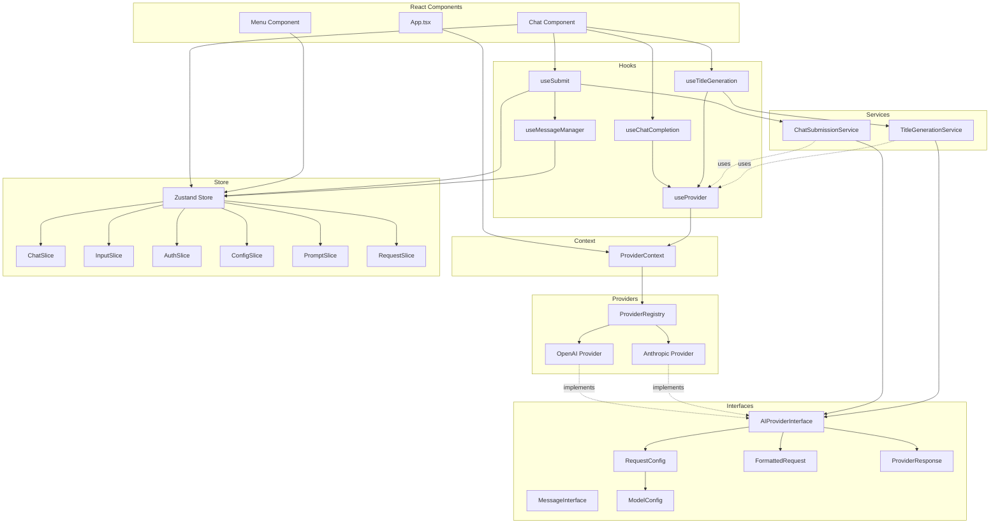
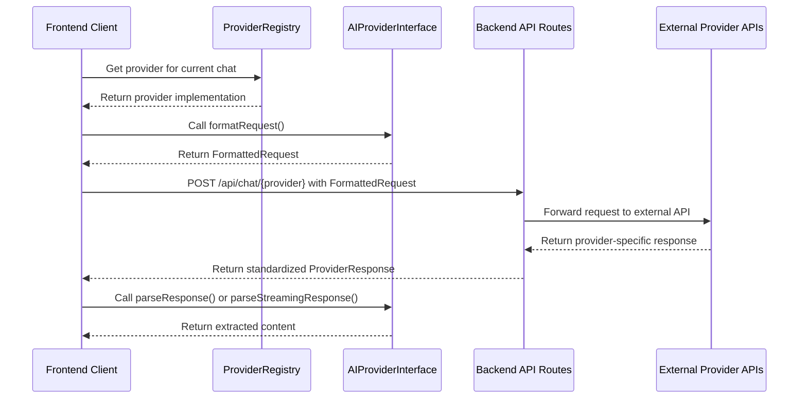

# Provider Architecture Interfaces

This document outlines the key interfaces in our provider architecture design, along with the motivation behind each interface based on SOLID principles and React patterns.



## Core Interfaces

### `AIProviderInterface`

The main interface that all AI providers must implement.

**Motivation:**
- **Single Responsibility Principle (SRP)**: Each provider implementation focuses solely on handling communication with a specific AI service.
- **Open/Closed Principle (OCP)**: New providers can be added without modifying existing code.
- **Interface Segregation Principle (ISP)**: The interface defines only the essential methods needed by all providers.
- **Dependency Inversion Principle (DIP)**: Components depend on abstractions (the interface) rather than concrete implementations.
- **React Context Pattern**: Enables dependency injection through React's context system.

```typescript
export interface AIProviderInterface {
    /**
     * Unique identifier for the provider
     */
    id: string;

    /**
     * Display name of the provider
     */
    name: string;

    /**
     * List of API endpoints this provider can use
     */
    endpoints: string[];

    /**
     * List of model IDs supported by this provider
     */
    models: string[];

    /**
     * Converts application request format to provider-specific format
     * @param config - Configuration for the request
     * @param messages - Array of messages to send to the AI
     * @returns Formatted request ready to send to the provider's API
     */
    formatRequest: (config: RequestConfig, messages: MessageInterface[]) => FormattedRequest;

    /**
     * Extracts content from a provider's non-streaming response
     * @param response - Raw response from the provider's API
     * @returns Extracted content as a string
     */
    parseResponse: (response: any) => string;

    /**
     * Extracts content from a provider's streaming response chunk
     * @param response - Raw response chunk from the provider's API
     * @returns Extracted content as a string
     */
    parseStreamingResponse: (response: any) => string;

    /**
     * Submits a completion request to the provider
     * @param formattedRequest - Request formatted for the provider's API
     * @returns Promise resolving to the provider's response
     */
    submitCompletion: (formattedRequest: FormattedRequest) => Promise<ProviderResponse>;

    /**
     * Submits a streaming request to the provider
     * @param formattedRequest - Request formatted for the provider's API
     * @returns Promise resolving to a ReadableStream of response chunks
     */
    submitStream: (formattedRequest: FormattedRequest) => Promise<ReadableStream>;
}
```

### `RequestConfig`

Configuration for AI requests, extending the base model config.

**Motivation:**
- **SRP**: Encapsulates all configuration parameters for a request.
- **OCP**: Extensible through optional fields for provider-specific features.
- **Composition over Inheritance**: Extends `ModelConfig` to reuse common configuration.
- **React Props Pattern**: Follows React's pattern of passing configuration as structured objects.

```typescript
export interface RequestConfig extends ModelConfig {
    /**
     * Whether to stream the response (true) or receive it all at once (false)
     * Optional in incoming config, defaults to false
     */
    stream?: boolean;

    /**
     * Configuration for thinking mode, which allows the AI to "think" before responding
     * This enables more thoughtful and comprehensive responses by allocating tokens for reasoning
     */
    thinking_mode?: {
        /**
         * Whether thinking mode is enabled for this request
         */
        enabled: boolean;

        /**
         * Maximum number of tokens to allocate for thinking
         * Higher values allow for more complex reasoning but consume more tokens
         */
        budget_tokens: number;
    };
}
```

### `FormattedRequest`

The standardized request format that providers convert to their specific API format.

**Motivation:**
- **SRP**: Represents the standardized request format across providers.
- **Liskov Substitution Principle (LSP)**: All provider-specific request formats can be derived from this base structure.
- **OCP**: Extensible through the index signature for provider-specific fields.
- **Information Hiding**: Abstracts provider-specific request details from components.

```typescript
export interface FormattedRequest {
    /**
     * Array of messages in provider-specific format
     * Each provider may have different message structure requirements
     */
    messages: any[];

    /**
     * Model identifier to use for this request (e.g., "gpt-4o", "claude-3-7-sonnet")
     */
    model: string;

    /**
     * Maximum number of tokens to generate in the response
     */
    max_tokens: number;

    /**
     * Controls randomness: 0 = deterministic, 1 = maximum randomness
     * Lower values make output more focused and deterministic
     * Higher values introduce more randomness and creativity
     */
    temperature: number;

    /**
     * Controls diversity via nucleus sampling
     * 0.1 = only consider tokens comprising the top 10% probability mass
     * 1.0 = consider all tokens (but still weighted by probability)
     */
    top_p?: number;

    /**
     * Whether to stream the response
     * When true, the response will be delivered in chunks
     * When false, the response will be delivered all at once
     */
    stream: boolean;

    /**
     * Thinking configuration for providers that support it (e.g., Anthropic)
     * Enables the AI to reason through complex problems before responding
     */
    thinking?: {
        /**
         * Type of thinking mode
         * - "enabled": AI will use thinking capabilities
         * - "disabled": AI will not use thinking capabilities
         */
        type: "enabled" | "disabled";

        /**
         * Maximum number of tokens to allocate for thinking
         * Higher values allow for more complex reasoning but consume more tokens
         */
        budget_tokens: number;
    };

    /**
     * System message for providers that support it separately from messages
     * (e.g., Anthropic treats system messages differently)
     */
    system?: string;

    /**
     * Reduces repetition of the same tokens
     * Higher values decrease likelihood of repeating the same phrases
     * Optional, as not all providers support this
     */
    presence_penalty?: number;

    /**
     * Reduces repetition of the same topics
     * Higher values decrease likelihood of discussing the same topics
     * Optional, as not all providers support this
     */
    frequency_penalty?: number;

    /**
     * Allow additional provider-specific request fields
     * Enables extensibility for provider-specific parameters
     */
    [key: string]: unknown;
}
```

### `ProviderResponse`

A standardized response format that providers convert their API responses to.

**Motivation:**
- **SRP**: Standardizes response formats across different providers.
- **LSP**: All provider-specific responses can be mapped to this common structure.
- **OCP**: Extensible through the index signature for provider-specific fields.
- **Adapter Pattern**: Acts as an adapter between provider-specific responses and application-wide format.

```typescript
export interface ProviderResponse {
    /**
     * Main content of the response
     * Can be a string or an array of content blocks (for providers like Anthropic)
     */
    content?: string | Array<{text: string}>;

    /**
     * Array of choices (for providers like OpenAI)
     * Each choice contains a message or delta with content
     */
    choices?: Array<{
        /**
         * Complete message in non-streaming responses
         */
        message?: {
            /**
             * Content of the message
             */
            content?: string
        };

        /**
         * Delta in streaming responses
         */
        delta?: {
            /**
             * Content chunk in the delta
             */
            content?: string
        };
    }>;

    /**
     * Type of response (for providers like Anthropic)
     * E.g., "content_block_delta" for streaming responses
     */
    type?: string;

    /**
     * Delta information for streaming responses (for providers like Anthropic)
     */
    delta?: {
        /**
         * Text chunk in the delta
         */
        text?: string;

        /**
         * Additional provider-specific delta fields
         */
        [key: string]: unknown;
    };

    /**
     * Allow additional provider-specific response fields
     * Enables extensibility for provider-specific response data
     */
    [key: string]: unknown;
}
```

### `MessageInterface`

Represents a message in a conversation.

**Motivation:**
- **SRP**: Encapsulates the structure of a single message.
- **Common Data Structure**: Provides a consistent format for messages across the application.
- **Data Transfer Object Pattern**: Acts as a pure data container for message information.

```typescript
export interface MessageInterface {
    /**
     * Role of the message sender
     * - system: Instructions or context for the AI
     * - user: Messages from the human user
     * - assistant: Messages from the AI assistant
     */
    role: 'system' | 'user' | 'assistant';

    /**
     * Content of the message
     */
    content: string;

    /**
     * Optional unique identifier for the message
     */
    id?: string;

    /**
     * Optional timestamp when the message was created
     * Stored as milliseconds since epoch
     */
    timestamp?: number;
}
```

### `ModelConfig`

Base configuration for AI models.

**Motivation:**
- **SRP**: Centralizes model-specific configuration parameters.
- **Separation of Concerns**: Separates model configuration from provider configuration.
- **Configuration Object Pattern**: Follows the pattern of grouping related configuration parameters.

```typescript
export interface ModelConfig {
    /**
     * Model identifier to use (e.g., "gpt-4o", "claude-3-7-sonnet")
     */
    model: string;

    /**
     * Controls randomness: 0 = deterministic, 1 = maximum randomness
     * Lower values make output more focused and deterministic
     * Higher values introduce more randomness and creativity
     */
    temperature: number;

    /**
     * Controls diversity via nucleus sampling
     * 0.1 = only consider tokens comprising the top 10% probability mass
     * 1.0 = consider all tokens (but still weighted by probability)
     */
    top_p?: number;

    /**
     * Maximum number of tokens to generate in the response
     */
    max_tokens: number;

    /**
     * Reduces repetition of the same tokens
     * Higher values decrease likelihood of repeating the same phrases
     * Optional, as not all providers support this
     */
    presence_penalty?: number;

    /**
     * Reduces repetition of the same topics
     * Higher values decrease likelihood of discussing the same topics
     * Optional, as not all providers support this
     */
    frequency_penalty?: number;

    /**
     * Whether thinking capability is enabled for this model
     * Thinking allows the AI to reason through complex problems before responding
     */
    thinking_mode?: {
    /**
         * Whether thinking is enabled
     */
        enabled: boolean;

        /**
         * Maximum number of tokens to allocate for thinking
         * Higher values allow for more complex reasoning but consume more tokens
         */
        budget_tokens: number;
    };
}
```

## Provider Registry Types

### `ProviderKey`

Type for supported providers.

**Motivation:**
- **Type Safety**: Ensures provider keys are valid throughout the application.
- **Extensibility**: Allows for adding new providers while maintaining type safety.

```typescript
/**
 * Identifier for supported AI providers
 * - 'openai': OpenAI API (GPT models)
 * - 'anthropic': Anthropic API (Claude models)
 * - string: Allows for future provider extensions
 */
export type ProviderKey = 'openai' | 'anthropic' | string;
```

### `ProviderConfig`

Configuration for a provider in the registry.

**Motivation:**
- **SRP**: Centralizes provider configuration management.
- **OCP**: New providers can be added by extending the registry.
- **DIP**: Components depend on the registry abstraction rather than specific providers.
- **Factory Pattern**: The registry acts as a factory for provider instances.
- **React Configuration Pattern**: Follows React's pattern of centralized configuration.

```typescript
export interface ProviderConfig {
    /**
     * Display name of the provider
     */
    name: string;

    /**
     * List of API endpoints this provider can use
     */
    endpoints: string[];

    /**
     * List of model IDs supported by this provider
         */
    models: string[];

        /**
     * Optional default model to use for this provider
         */
    defaultModel?: string;

        /**
     * Optional configuration for provider-specific features
                 */
    features?: {
                /**
         * Whether this provider supports thinking mode
                 */
        supportsThinking?: boolean;

            /**
         * Whether this provider supports streaming responses
                 */
        supportsStreaming?: boolean;

                /**
         * Additional provider-specific feature flags
                 */
        [key: string]: boolean | undefined;
            };
        }
```

## Hook Return Types

### `UseTitleGenerationReturn`

Return type for the useTitleGeneration hook.

**Motivation:**
- **SRP**: The hook has a single, focused responsibility.
- **ISP**: Hook interface exposes only the methods needed by consumers.
- **React Hooks Pattern**: Follows React's pattern of encapsulating logic in hooks.
- **Command Pattern**: Each method represents a specific command operation.

```typescript
export interface UseTitleGenerationReturn {
    /**
     * Generates a title for a chat based on its messages
     *
     * @param messages - Array of messages in the chat
     * @param config - Model configuration to use for title generation
     * @param chatIndex - Optional index of the chat to update (defaults to current chat)
     * @returns Promise that resolves when title generation is complete
     *
     * The function will:
     * 1. Check if the chat already has a title
     * 2. Create a special prompt for title generation
     * 3. Submit the request to the AI provider
     * 4. Update the chat with the generated title
     */
    generateTitle: (
        messages: MessageInterface[],
        config: ModelConfig,
        chatIndex?: number
    ) => Promise<void>;
}
```

### `UseChatCompletionReturn`

Return type for the useChatCompletion hook.

**Motivation:**
- **SRP**: The hook has a single, focused responsibility.
- **ISP**: Hook interface exposes only the methods needed by consumers.
- **React Hooks Pattern**: Follows React's pattern of encapsulating logic in hooks.
- **Facade Pattern**: Provides a simplified interface to the underlying provider complexity.

```typescript
export interface UseChatCompletionReturn {
    /**
     * Generates a completion for a chat conversation
     *
     * @param messages - Array of messages in the conversation
     * @param config - Model configuration to use for completion
     * @returns Promise resolving to the generated completion text
     *
     * This method handles the entire completion process:
     * 1. Formatting the request for the provider
     * 2. Submitting the request
     * 3. Parsing the response
     */
    generateCompletion: (
        messages: MessageInterface[],
        config: ModelConfig
    ) => Promise<string>;

    /**
     * Generates a streaming completion for a chat conversation
     *
     * @param messages - Array of messages in the conversation
     * @param config - Model configuration to use for completion
     * @param onChunk - Callback function that receives each chunk of the response
     * @returns Promise that resolves when the stream is complete
     *
     * This method handles the streaming completion process:
     * 1. Formatting the request for the provider with streaming enabled
     * 2. Submitting the streaming request
     * 3. Processing each chunk and calling the onChunk callback
     */
    generateCompletionStream: (
        messages: MessageInterface[],
        config: ModelConfig,
        onChunk: (chunk: string) => void
    ) => Promise<void>;
}
```

## API Contracts

### Frontend-Backend Communication

The communication between the frontend and backend follows a standardized contract pattern to ensure consistency, security, and maintainability.



**Motivation:**
- **Security**: API keys are never exposed to the client, only stored and used on the server
- **Standardization**: Consistent request and response formats across different providers
- **Separation of Concerns**: Each component has a clear, focused responsibility
- **Maintainability**: Changes to provider APIs only require updates in one place
- **Extensibility**: New providers can be added with minimal changes to the architecture

### Request Contract

When the frontend makes a request to the backend, it follows this standardized format:

```typescript
interface BackendRequestBody {
  /**
   * Provider-specific formatted request created by AIProviderInterface.formatRequest
   * Contains all necessary parameters for the AI provider API
   */
  formattedRequest: FormattedRequest;
  
  /**
   * API key for the provider
   * Retrieved from secure storage and sent to the backend
   * Never exposed in client-side code
   */
  apiKey: string;
}
```

**Motivation:**
- **Single Responsibility Principle (SRP)**: The frontend is responsible only for formatting the request according to the provider's requirements, while the backend is responsible for securely communicating with the external API.
- **Dependency Inversion Principle (DIP)**: Both frontend and backend depend on the shared `FormattedRequest` interface rather than specific implementation details.
- **Information Hiding**: The details of how requests are formatted are encapsulated within the provider implementation.
- **Consistency**: All providers use the same request structure, making the code more maintainable.

### Response Contract

The backend returns responses in a standardized format that matches the `ProviderResponse` interface:

```typescript
interface ProviderResponse {
  content?: string | Array<{text: string}>;
  choices?: Array<{
    message?: { content?: string };
    delta?: { content?: string };
  }>;
  type?: string;
  delta?: { 
    text?: string;
    [key: string]: unknown;
  };
  [key: string]: unknown;
}
```

**Motivation:**
- **Adapter Pattern**: The backend acts as an adapter between provider-specific response formats and the standardized format used by the application.
- **Liskov Substitution Principle (LSP)**: All provider responses can be treated uniformly by the frontend.
- **Open/Closed Principle (OCP)**: The response format is extensible through the index signature for provider-specific fields.
- **Abstraction**: The frontend doesn't need to know the details of each provider's response format.

### Streaming Response Contract

For streaming responses, the backend uses Server-Sent Events (SSE) with a standardized event format:

```
data: {"type":"content_block_delta","delta":{"text":"Hello"}}

data: {"type":"content_block_delta","delta":{"text":" world"}}

data: [DONE]
```

**Motivation:**
- **Real-time Updates**: Allows for incremental updates to the UI as responses are generated.
- **Efficiency**: Reduces perceived latency by showing partial responses immediately.
- **Standardization**: Uses the well-established SSE protocol for streaming data.
- **Compatibility**: Works across all modern browsers and with server frameworks.


## Implementation Guidelines

### Backend Route Handlers

Backend route handlers should:

1. Accept POST requests with the standardized request body
2. Extract the `formattedRequest` and `apiKey` from the request
3. Initialize the appropriate AI provider client
4. Forward the request to the external API
5. Format the response according to the standardized response contract
6. Handle errors and return appropriate error responses

### Frontend Provider Implementations

Frontend provider implementations should:

1. Implement the `AIProviderInterface`
2. Format requests using the `formatRequest` method
3. Send requests to the backend with the standardized request body
4. Parse responses using the `parseResponse` or `parseStreamingResponse` methods
5. Handle errors and provide meaningful error messages


## Capability Configuration

Each capability can define its own configuration structure, which is stored within the `ModelConfig` object. The configuration should follow these guidelines:


Example for Thinking Mode capability:

```typescript
// In ModelConfig interface
export interface ModelConfig {
  model: string;
  max_tokens: number;
  temperature: number;
  // ... other standard fields
  
  // Capability-specific configurations
  thinking_mode?: {
    enabled: boolean;
    budget_tokens: number;
  };
  
  file_upload?: {
    enabled: boolean;
    maxFiles: number;
    maxSizePerFile: number;
  };
  
  // Allow for future capabilities
  [key: string]: any;
}
```
