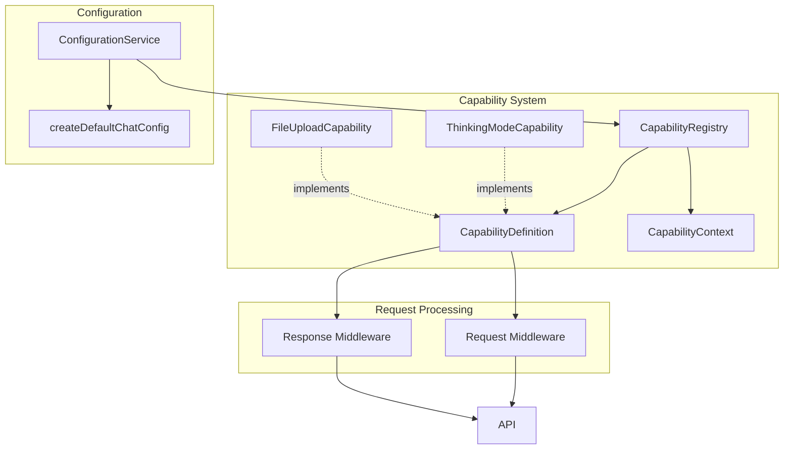
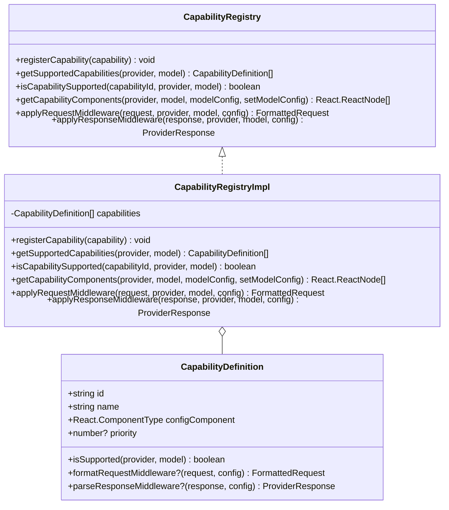
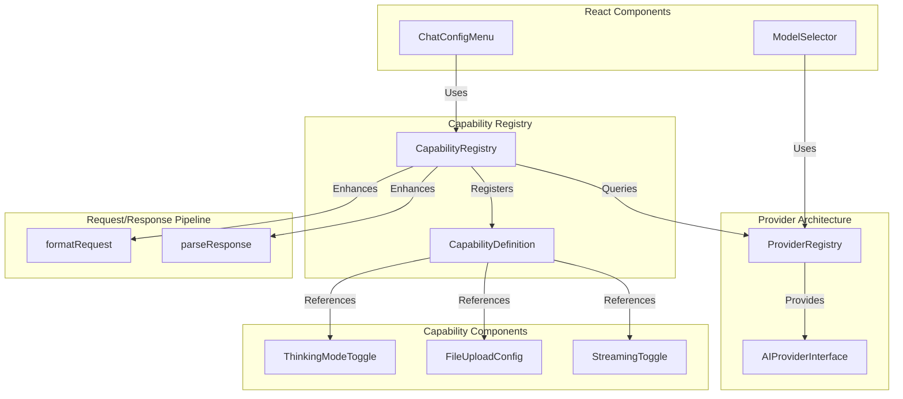
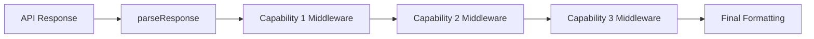
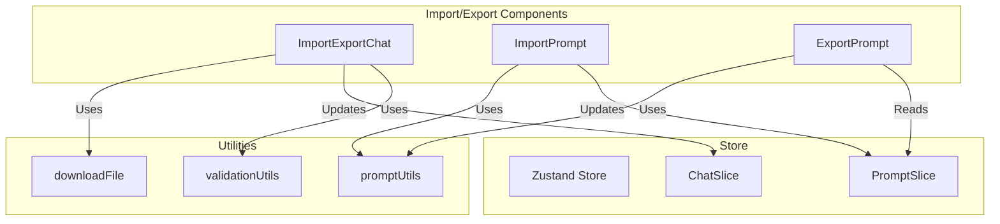
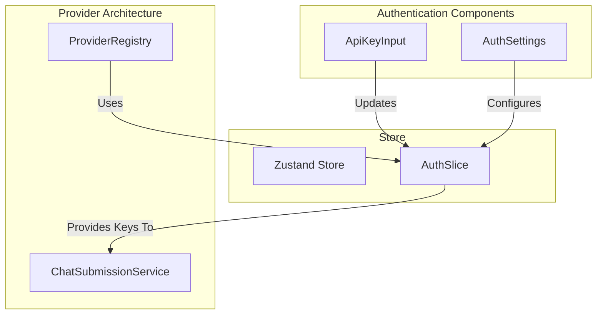

# Provider Architecture Interfaces

This document outlines the key interfaces in our provider architecture design, along with the motivation behind each interface based on SOLID principles and React patterns.


## Core Interfaces

### `AIProviderInterface`

The main interface that all AI providers must implement.

**Motivation:**
- **Single Responsibility Principle (SRP)**: Each provider implementation focuses solely on handling communication with a specific AI service.
- **Open/Closed Principle (OCP)**: New providers can be added without modifying existing code.
- **Interface Segregation Principle (ISP)**: The interface defines only the essential methods needed by all providers.
- **Dependency Inversion Principle (DIP)**: Components depend on abstractions (the interface) rather than concrete implementations.
- **React Context Pattern**: Enables dependency injection through React's context system.

```typescript
export interface AIProviderInterface {
    /**
     * Unique identifier for the provider
     */
    id: string;

    /**
     * Display name of the provider
     */
    name: string;

    /**
     * List of API endpoints this provider can use
     */
    endpoints: string[];

    /**
     * List of model IDs supported by this provider
     */
    models: string[];

    /**
     * Converts application request format to provider-specific format
     * @param config - Configuration for the request
     * @param messages - Array of messages to send to the AI
     * @returns Formatted request ready to send to the provider's API
     */
    formatRequest: (config: RequestConfig, messages: MessageInterface[]) => FormattedRequest;

    /**
     * Extracts content from a provider's non-streaming response
     * @param response - Raw response from the provider's API
     * @returns Extracted content as a string
     */
    parseResponse: (response: any) => string;

    /**
     * Extracts content from a provider's streaming response chunk
     * @param response - Raw response chunk from the provider's API
     * @returns Extracted content as a string
     */
    parseStreamingResponse: (response: any) => string;

    /**
     * Submits a completion request to the provider
     * @param formattedRequest - Request formatted for the provider's API
     * @returns Promise resolving to the provider's response
     */
    submitCompletion: (formattedRequest: FormattedRequest) => Promise<ProviderResponse>;

    /**
     * Submits a streaming request to the provider
     * @param formattedRequest - Request formatted for the provider's API
     * @returns Promise resolving to a ReadableStream of response chunks
     */
    submitStream: (formattedRequest: FormattedRequest) => Promise<ReadableStream>;
}
```

### `RequestConfig`

Configuration for AI requests, extending the base model config.

**Motivation:**
- **SRP**: Encapsulates all configuration parameters for a request.
- **OCP**: Extensible through optional fields for provider-specific features.
- **Composition over Inheritance**: Extends `ModelConfig` to reuse common configuration.
- **React Props Pattern**: Follows React's pattern of passing configuration as structured objects.

```typescript
export interface RequestConfig extends ModelConfig {
    /**
     * Whether to stream the response (true) or receive it all at once (false)
     * Optional in incoming config, defaults to false
     */
    stream?: boolean;

    /**
     * Configuration for thinking mode, which allows the AI to "think" before responding
     * This enables more thoughtful and comprehensive responses by allocating tokens for reasoning
     */
    thinking_mode?: {
        /**
         * Whether thinking mode is enabled for this request
         */
        enabled: boolean;

        /**
         * Maximum number of tokens to allocate for thinking
         * Higher values allow for more complex reasoning but consume more tokens
         */
        budget_tokens: number;
    };
}
```

### `FormattedRequest`

The standardized request format that providers convert to their specific API format.

**Motivation:**
- **SRP**: Represents the standardized request format across providers.
- **Liskov Substitution Principle (LSP)**: All provider-specific request formats can be derived from this base structure.
- **OCP**: Extensible through the index signature for provider-specific fields.
- **Information Hiding**: Abstracts provider-specific request details from components.

```typescript
export interface FormattedRequest {
    /**
     * Array of messages in provider-specific format
     * Each provider may have different message structure requirements
     */
    messages: any[];

    /**
     * Model identifier to use for this request (e.g., "gpt-4o", "claude-3-7-sonnet")
     */
    model: string;

    /**
     * Maximum number of tokens to generate in the response
     */
    max_tokens: number;

    /**
     * Controls randomness: 0 = deterministic, 1 = maximum randomness
     * Lower values make output more focused and deterministic
     * Higher values introduce more randomness and creativity
     */
    temperature: number;

    /**
     * Controls diversity via nucleus sampling
     * 0.1 = only consider tokens comprising the top 10% probability mass
     * 1.0 = consider all tokens (but still weighted by probability)
     */
    top_p?: number;

    /**
     * Whether to stream the response
     * When true, the response will be delivered in chunks
     * When false, the response will be delivered all at once
     */
    stream: boolean;

    /**
     * Thinking configuration for providers that support it (e.g., Anthropic)
     * Enables the AI to reason through complex problems before responding
     */
    thinking?: {
        /**
         * Type of thinking mode
         * - "enabled": AI will use thinking capabilities
         * - "disabled": AI will not use thinking capabilities
         */
        type: "enabled" | "disabled";

        /**
         * Maximum number of tokens to allocate for thinking
         * Higher values allow for more complex reasoning but consume more tokens
         */
        budget_tokens: number;
    };

    /**
     * System message for providers that support it separately from messages
     * (e.g., Anthropic treats system messages differently)
     */
    system?: string;

    /**
     * Reduces repetition of the same tokens
     * Higher values decrease likelihood of repeating the same phrases
     * Optional, as not all providers support this
     */
    presence_penalty?: number;

    /**
     * Reduces repetition of the same topics
     * Higher values decrease likelihood of discussing the same topics
     * Optional, as not all providers support this
     */
    frequency_penalty?: number;

    /**
     * Allow additional provider-specific request fields
     * Enables extensibility for provider-specific parameters
     */
    [key: string]: unknown;
}
```

### `ProviderResponse`

A standardized response format that providers convert their API responses to.

**Motivation:**
- **SRP**: Standardizes response formats across different providers.
- **LSP**: All provider-specific responses can be mapped to this common structure.
- **OCP**: Extensible through the index signature for provider-specific fields.
- **Adapter Pattern**: Acts as an adapter between provider-specific responses and application-wide format.

```typescript
export interface ProviderResponse {
    /**
     * Main content of the response
     * Can be a string or an array of content blocks (for providers like Anthropic)
     */
    content?: string | Array<{text: string}>;

    /**
     * Array of choices (for providers like OpenAI)
     * Each choice contains a message or delta with content
     */
    choices?: Array<{
        /**
         * Complete message in non-streaming responses
         */
        message?: {
            /**
             * Content of the message
             */
            content?: string
        };

        /**
         * Delta in streaming responses
         */
        delta?: {
            /**
             * Content chunk in the delta
             */
            content?: string
        };
    }>;

    /**
     * Type of response (for providers like Anthropic)
     * E.g., "content_block_delta" for streaming responses
     */
    type?: string;

    /**
     * Delta information for streaming responses (for providers like Anthropic)
     */
    delta?: {
        /**
         * Text chunk in the delta
         */
        text?: string;

        /**
         * Additional provider-specific delta fields
         */
        [key: string]: unknown;
    };

    /**
     * Allow additional provider-specific response fields
     * Enables extensibility for provider-specific response data
     */
    [key: string]: unknown;
}
```

### `MessageInterface`

Represents a message in a conversation.

**Motivation:**
- **SRP**: Encapsulates the structure of a single message.
- **Common Data Structure**: Provides a consistent format for messages across the application.
- **Data Transfer Object Pattern**: Acts as a pure data container for message information.

```typescript
export interface MessageInterface {
    /**
     * Role of the message sender
     * - system: Instructions or context for the AI
     * - user: Messages from the human user
     * - assistant: Messages from the AI assistant
     */
    role: 'system' | 'user' | 'assistant';

    /**
     * Content of the message
     */
    content: string;

    /**
     * Optional unique identifier for the message
     */
    id?: string;

    /**
     * Optional timestamp when the message was created
     * Stored as milliseconds since epoch
     */
    timestamp?: number;
}
```

### `ModelConfig`

Base configuration for AI models.

**Motivation:**
- **SRP**: Centralizes model-specific configuration parameters.
- **Separation of Concerns**: Separates model configuration from provider configuration.
- **Configuration Object Pattern**: Follows the pattern of grouping related configuration parameters.

```typescript
export interface ModelConfig {
    /**
     * Model identifier to use (e.g., "gpt-4o", "claude-3-7-sonnet")
     */
    model: string;

    /**
     * Controls randomness: 0 = deterministic, 1 = maximum randomness
     * Lower values make output more focused and deterministic
     * Higher values introduce more randomness and creativity
     */
    temperature: number;

    /**
     * Controls diversity via nucleus sampling
     * 0.1 = only consider tokens comprising the top 10% probability mass
     * 1.0 = consider all tokens (but still weighted by probability)
     */
    top_p?: number;

    /**
     * Maximum number of tokens to generate in the response
     */
    max_tokens: number;

    /**
     * Reduces repetition of the same tokens
     * Higher values decrease likelihood of repeating the same phrases
     * Optional, as not all providers support this
     */
    presence_penalty?: number;

    /**
     * Reduces repetition of the same topics
     * Higher values decrease likelihood of discussing the same topics
     * Optional, as not all providers support this
     */
    frequency_penalty?: number;

    /**
     * Whether thinking capability is enabled for this model
     * Thinking allows the AI to reason through complex problems before responding
     */
    thinking_mode?: {
    /**
         * Whether thinking is enabled
     */
        enabled: boolean;

        /**
         * Maximum number of tokens to allocate for thinking
         * Higher values allow for more complex reasoning but consume more tokens
         */
        budget_tokens: number;
    };
}
```

## Provider Registry Types

### `ProviderKey`

Type for supported providers.

**Motivation:**
- **Type Safety**: Ensures provider keys are valid throughout the application.
- **Extensibility**: Allows for adding new providers while maintaining type safety.

```typescript
/**
 * Identifier for supported AI providers
 * - 'openai': OpenAI API (GPT models)
 * - 'anthropic': Anthropic API (Claude models)
 * - string: Allows for future provider extensions
 */
export type ProviderKey = 'openai' | 'anthropic' | string;
```

### `ProviderConfig`

Configuration for a provider in the registry.

**Motivation:**
- **SRP**: Centralizes provider configuration management.
- **OCP**: New providers can be added by extending the registry.
- **DIP**: Components depend on the registry abstraction rather than specific providers.
- **Factory Pattern**: The registry acts as a factory for provider instances.
- **React Configuration Pattern**: Follows React's pattern of centralized configuration.

```typescript
export interface ProviderConfig {
    /**
     * Display name of the provider
     */
    name: string;

    /**
     * List of API endpoints this provider can use
     */
    endpoints: string[];

    /**
     * List of model IDs supported by this provider
         */
    models: string[];

        /**
     * Optional default model to use for this provider
         */
    defaultModel?: string;

        /**
     * Optional configuration for provider-specific features
                 */
    features?: {
                /**
         * Whether this provider supports thinking mode
                 */
        supportsThinking?: boolean;

            /**
         * Whether this provider supports streaming responses
                 */
        supportsStreaming?: boolean;

                /**
         * Additional provider-specific feature flags
                 */
        [key: string]: boolean | undefined;
            };
        }
```

## Context Types

### `ProviderContextType`

Type for the provider context.

**Motivation:**
- **DIP**: Components depend on the provider abstraction through context.
- **React Context API**: Leverages React's built-in dependency injection mechanism.
- **Inversion of Control**: Control over provider selection is moved to the context provider.
- **Composition Pattern**: Enables composition of components with provider capabilities.

```typescript
/**
 * Type for the provider context
 * - AIProviderInterface: When a provider is selected and available
 * - null: When no provider is selected or available
 *
 * Used with React's Context API to make the current provider available throughout the component tree
 */
export type ProviderContextType = AIProviderInterface | null;
```

## Hook Return Types

### `UseTitleGenerationReturn`

Return type for the useTitleGeneration hook.

**Motivation:**
- **SRP**: The hook has a single, focused responsibility.
- **ISP**: Hook interface exposes only the methods needed by consumers.
- **React Hooks Pattern**: Follows React's pattern of encapsulating logic in hooks.
- **Command Pattern**: Each method represents a specific command operation.

```typescript
export interface UseTitleGenerationReturn {
    /**
     * Generates a title for a chat based on its messages
     *
     * @param messages - Array of messages in the chat
     * @param config - Model configuration to use for title generation
     * @param chatIndex - Optional index of the chat to update (defaults to current chat)
     * @returns Promise that resolves when title generation is complete
     *
     * The function will:
     * 1. Check if the chat already has a title
     * 2. Create a special prompt for title generation
     * 3. Submit the request to the AI provider
     * 4. Update the chat with the generated title
     */
    generateTitle: (
        messages: MessageInterface[],
        config: ModelConfig,
        chatIndex?: number
    ) => Promise<void>;
}
```

### `UseChatCompletionReturn`

Return type for the useChatCompletion hook.

**Motivation:**
- **SRP**: The hook has a single, focused responsibility.
- **ISP**: Hook interface exposes only the methods needed by consumers.
- **React Hooks Pattern**: Follows React's pattern of encapsulating logic in hooks.
- **Facade Pattern**: Provides a simplified interface to the underlying provider complexity.

```typescript
export interface UseChatCompletionReturn {
    /**
     * Generates a completion for a chat conversation
     *
     * @param messages - Array of messages in the conversation
     * @param config - Model configuration to use for completion
     * @returns Promise resolving to the generated completion text
     *
     * This method handles the entire completion process:
     * 1. Formatting the request for the provider
     * 2. Submitting the request
     * 3. Parsing the response
     */
    generateCompletion: (
        messages: MessageInterface[],
        config: ModelConfig
    ) => Promise<string>;

    /**
     * Generates a streaming completion for a chat conversation
     *
     * @param messages - Array of messages in the conversation
     * @param config - Model configuration to use for completion
     * @param onChunk - Callback function that receives each chunk of the response
     * @returns Promise that resolves when the stream is complete
     *
     * This method handles the streaming completion process:
     * 1. Formatting the request for the provider with streaming enabled
     * 2. Submitting the streaming request
     * 3. Processing each chunk and calling the onChunk callback
     */
    generateCompletionStream: (
        messages: MessageInterface[],
        config: ModelConfig,
        onChunk: (chunk: string) => void
    ) => Promise<void>;
}
```

## API Contracts

### Frontend-Backend Communication

The communication between the frontend and backend follows a standardized contract pattern to ensure consistency, security, and maintainability.


**Motivation:**
- **Security**: API keys are never exposed to the client, only stored and used on the server
- **Standardization**: Consistent request and response formats across different providers
- **Separation of Concerns**: Each component has a clear, focused responsibility
- **Maintainability**: Changes to provider APIs only require updates in one place
- **Extensibility**: New providers can be added with minimal changes to the architecture

### Request Contract

When the frontend makes a request to the backend, it follows this standardized format:

```typescript
interface BackendRequestBody {
  /**
   * Provider-specific formatted request created by AIProviderInterface.formatRequest
   * Contains all necessary parameters for the AI provider API
   */
  formattedRequest: FormattedRequest;
  
  /**
   * API key for the provider
   * Retrieved from secure storage and sent to the backend
   * Never exposed in client-side code
   */
  apiKey: string;
}
```

**Motivation:**
- **Single Responsibility Principle (SRP)**: The frontend is responsible only for formatting the request according to the provider's requirements, while the backend is responsible for securely communicating with the external API.
- **Dependency Inversion Principle (DIP)**: Both frontend and backend depend on the shared `FormattedRequest` interface rather than specific implementation details.
- **Information Hiding**: The details of how requests are formatted are encapsulated within the provider implementation.
- **Consistency**: All providers use the same request structure, making the code more maintainable.

### Response Contract

The backend returns responses in a standardized format that matches the `ProviderResponse` interface:

```typescript
interface ProviderResponse {
  content?: string | Array<{text: string}>;
  choices?: Array<{
    message?: { content?: string };
    delta?: { content?: string };
  }>;
  type?: string;
  delta?: { 
    text?: string;
    [key: string]: unknown;
  };
  [key: string]: unknown;
}
```

**Motivation:**
- **Adapter Pattern**: The backend acts as an adapter between provider-specific response formats and the standardized format used by the application.
- **Liskov Substitution Principle (LSP)**: All provider responses can be treated uniformly by the frontend.
- **Open/Closed Principle (OCP)**: The response format is extensible through the index signature for provider-specific fields.
- **Abstraction**: The frontend doesn't need to know the details of each provider's response format.

### Streaming Response Contract

For streaming responses, the backend uses Server-Sent Events (SSE) with a standardized event format:

```
data: {"type":"content_block_delta","delta":{"text":"Hello"}}

data: {"type":"content_block_delta","delta":{"text":" world"}}

data: [DONE]
```

**Motivation:**
- **Real-time Updates**: Allows for incremental updates to the UI as responses are generated.
- **Efficiency**: Reduces perceived latency by showing partial responses immediately.
- **Standardization**: Uses the well-established SSE protocol for streaming data.
- **Compatibility**: Works across all modern browsers and with server frameworks.

### Error Handling Contract

Errors are returned in a consistent format:

```typescript
interface ErrorResponse {
  error: string;
  status: number;
  type?: string;
  details?: string;
}
```

**Motivation:**
- **Robustness**: Proper error handling improves application reliability.
- **User Experience**: Meaningful error messages help users understand and resolve issues.
- **Debugging**: Detailed error information aids in troubleshooting.
- **Consistency**: Standardized error format makes error handling more maintainable.

## Capability System

The capability system allows for extensible provider features without modifying core code.



### `CapabilityDefinition`

The interface that all capabilities must implement.

```typescript
export interface CapabilityDefinition {
    /**
     * Unique identifier for the capability
     */
    id: string;
    
    /**
     * Display name of the capability
     */
    name: string;
    
    /**
     * Priority for ordering in UI (higher = shown first)
     */
    priority: number;
    
    /**
     * Determines if this capability is supported by a provider/model
     */
    isSupported: (provider: ProviderKey, model: string) => boolean;
    
    /**
     * React component for configuring this capability
     */
    configComponent: React.ComponentType<{
        modelConfig: ModelConfig;
        setModelConfig: (config: ModelConfig) => void;
    }>;
    
    /**
     * Optional middleware to modify outgoing requests
     */
    formatRequestMiddleware?: (request: FormattedRequest, context: CapabilityContext) => FormattedRequest;
    
    /**
     * Optional middleware to modify incoming responses
     */
    parseResponseMiddleware?: (response: ProviderResponse, context: CapabilityContext) => ProviderResponse;
}
```

### `CapabilityRegistry`

Registry that manages provider capabilities and their detection.

**Motivation:**
- **SRP**: Centralizes capability management.
- **OCP**: New capabilities can be registered without modifying existing code.
- **DIP**: Components depend on the registry abstraction rather than specific capabilities.
- **Factory Pattern**: The registry acts as a factory for capability instances.
- **React Configuration Pattern**: Follows React's pattern of centralized configuration.

```typescript
export interface CapabilityRegistry {
  /**
   * Registers a new capability in the registry
   * @param capability - Capability definition to register
   */
  registerCapability: (capability: CapabilityDefinition) => void;
  
  /**
   * Gets all capabilities supported by a specific provider and model
   * @param provider - Provider key
   * @param model - Model identifier
   * @returns Array of supported capabilities
   */
  getSupportedCapabilities: (provider: ProviderKey, model: string) => CapabilityDefinition[];
  
  /**
   * Checks if a specific capability is supported by a provider and model
   * @param capabilityId - Capability identifier
   * @param provider - Provider key
   * @param model - Model identifier
   * @returns Boolean indicating if the capability is supported
   */
  isCapabilitySupported: (capabilityId: string, provider: ProviderKey, model: string) => boolean;
  
  /**
   * Gets UI components for all capabilities supported by a provider and model
   * @param provider - Provider key
   * @param model - Model identifier
   * @returns Array of capability UI components with their props
   */
  getCapabilityComponents: (
    provider: ProviderKey, 
    model: string, 
    modelConfig: ModelConfig, 
    setModelConfig: (config: ModelConfig) => void
  ) => React.ReactNode[];
  
  /**
   * Applies all capability middleware to a request
   * @param request - The formatted request
   * @param provider - Provider key
   * @param model - Model identifier
   * @param config - The model configuration
   * @returns Request with all applicable capability middleware applied
   */
  applyRequestMiddleware: (
    request: FormattedRequest, 
    provider: ProviderKey, 
    model: string, 
    config: ModelConfig
  ) => FormattedRequest;
  
  /**
   * Applies all capability middleware to a response
   * @param response - The provider response
   * @param provider - Provider key
   * @param model - Model identifier
   * @param config - The model configuration
   * @returns Response with all applicable capability middleware applied
   */
  applyResponseMiddleware: (
    response: ProviderResponse, 
    provider: ProviderKey, 
    model: string, 
    config: ModelConfig
  ) => ProviderResponse;
}
```

## Capability Registry Implementation

The implementation of the Capability Registry follows a singleton pattern to ensure consistent access throughout the application.



## Integration with Provider Architecture

The Capability Registry integrates with the existing provider architecture as follows:



This architecture ensures that:
1. New capabilities can be added without modifying existing code
2. UI components for capabilities are dynamically rendered based on provider support
3. Request and response processing can be enhanced by capability-specific middleware
4. The system remains extensible for future AI model capabilities

## Implementation Guidelines

### Backend Route Handlers

Backend route handlers should:

1. Accept POST requests with the standardized request body
2. Extract the `formattedRequest` and `apiKey` from the request
3. Initialize the appropriate AI provider client
4. Forward the request to the external API
5. Format the response according to the standardized response contract
6. Handle errors and return appropriate error responses

### Frontend Provider Implementations

Frontend provider implementations should:

1. Implement the `AIProviderInterface`
2. Format requests using the `formatRequest` method
3. Send requests to the backend with the standardized request body
4. Parse responses using the `parseResponse` or `parseStreamingResponse` methods
5. Handle errors and provide meaningful error messages

This contract-based approach ensures that the frontend and backend can evolve independently while maintaining compatibility, and that new providers can be added with minimal changes to the existing codebase.

## Capability Registry Interfaces

### `CapabilityContext`

Context provided to capability middleware functions.

**Motivation:**
- **Information Hiding**: Encapsulates all necessary context without exposing implementation details.
- **Dependency Injection**: Provides middleware functions with all required dependencies.
- **Extensibility**: Can be extended with additional context information without breaking existing middleware.

```typescript
export interface CapabilityContext {
  /**
   * Provider key (e.g., 'openai', 'anthropic')
   */
  provider: ProviderKey;
  
  /**
   * Model identifier (e.g., 'gpt-4o', 'claude-3-7-sonnet')
   */
  model: string;
  
  /**
   * Current model configuration
   */
  modelConfig: ModelConfig;
  
  /**
   * Optional capability-specific configuration
   */
  capabilityConfig?: Record<string, any>;
}
```

### `CapabilityComponentProps`

Standard props interface for capability configuration components.

**Motivation:**
- **Consistency**: Ensures all capability components receive the same base props.
- **Type Safety**: Provides type checking for component props.
- **Extensibility**: Allows for additional props through generics.

```typescript
export interface CapabilityComponentProps<T = any> {
  /**
   * Current model configuration
   */
  modelConfig: ModelConfig;
  
  /**
   * Function to update model configuration
   */
  setModelConfig: (config: ModelConfig) => void;
  
  /**
   * Provider key
   */
  provider: ProviderKey;
  
  /**
   * Model identifier
   */
  model: string;
  
  /**
   * Capability-specific configuration
   */
  capabilityConfig?: T;
}
```

## Middleware Execution

### Request Middleware Pipeline

The request middleware pipeline processes requests in the following order:

1. **Base request formatting**: The provider's `formatRequest` method creates the initial request.
2. **Capability middleware application**: Each capability's `formatRequestMiddleware` is applied in order of priority (highest first).
3. **Final request validation**: The request is validated before being sent to the API.


### Response Middleware Pipeline

The response middleware pipeline processes responses in the following order:

1. **Initial response parsing**: The provider's `parseResponse` method extracts the basic content.
2. **Capability middleware application**: Each capability's `parseResponseMiddleware` is applied in order of priority (highest first).
3. **Final response formatting**: The response is formatted for display in the UI.



## Capability Configuration

Each capability can define its own configuration structure, which is stored within the `ModelConfig` object. The configuration should follow these guidelines:

1. **Namespace**: Use the capability ID as the configuration key.
2. **Type Safety**: Define TypeScript interfaces for the configuration.
3. **Defaults**: Provide sensible default values.
4. **Validation**: Include validation logic for configuration values.

Example for Thinking Mode capability:

```typescript
// In ModelConfig interface
export interface ModelConfig {
  model: string;
  max_tokens: number;
  temperature: number;
  // ... other standard fields
  
  // Capability-specific configurations
  thinking_mode?: {
    enabled: boolean;
    budget_tokens: number;
  };
  
  file_upload?: {
    enabled: boolean;
    maxFiles: number;
    maxSizePerFile: number;
  };
  
  // Allow for future capabilities
  [key: string]: any;
}
```

## Import/Export Functionality

The architecture supports importing and exporting chat data to enable portability and backup capabilities.



### `ImportData` Interface

Defines the structure for importing chat data.

**Motivation:**
- **Data Portability**: Enables users to move their data between instances.
- **Backward Compatibility**: Versioned format allows for handling different export versions.
- **Data Integrity**: Validation ensures imported data meets application requirements.
- **Type Safety**: Strongly typed interface prevents runtime errors during import.

```typescript
export interface ImportData {
  /**
   * Version number of the export format
   * Used for backward compatibility
   */
  version: number;
  
  /**
   * Array of chat objects
   */
  chats: ImportChat[];
  
  /**
   * Collection of folders
   */
  folders?: Record<string, ImportFolder>;
}
```

### `ImportChat` Interface

Defines the structure for importing individual chats.

**Motivation:**
- **SRP**: Represents a single chat with all its messages and configuration.
- **LSP**: All chat implementations can be derived from this base structure.
- **OCP**: Extensible through provider-specific configuration.

```typescript
export interface ImportChat {
  /**
   * Unique identifier for the chat
   */
  id: string;
  
  /**
   * Display title of the chat
   */
  title: string;
  
  /**
   * Array of messages in the chat
   */
  messages: ImportMessage[];
  
  /**
   * Chat configuration including provider and model settings
   */
  config: ImportChatConfig;
  
  /**
   * Optional folder ID this chat belongs to
   */
  folder?: string;
}
```

### Export Contract

When exporting data, the application follows this standardized format:

```typescript
interface Export {
  /**
   * Version number of the export format
   */
  version: number;
  
  /**
   * Array of chat objects
   */
  chats: ChatInterface[];
  
  /**
   * Collection of folders
   */
  folders: FolderCollection;
}
```

**Motivation:**
- **Versioning**: Enables backward compatibility for future format changes.
- **Completeness**: Includes all necessary data for a full application state restoration.
- **Consistency**: Standardized format ensures reliable import/export operations.

## Authentication Integration

The provider architecture integrates with authentication to securely manage API keys and provider access.



### `AuthSlice` Interface

Manages authentication state for provider API keys.

**Motivation:**
- **Security**: Centralizes API key management.
- **SRP**: Separates authentication concerns from provider implementation.
- **DIP**: Provider implementations depend on the auth abstraction rather than specific storage mechanisms.
- **Encapsulation**: Hides the details of how API keys are stored and retrieved.

```typescript
export interface AuthSlice {
  /**
   * API keys for different providers
   */
  apiKeys: Record<ProviderKey, string>;
  
  /**
   * Sets an API key for a specific provider
   * @param provider - Provider key
   * @param apiKey - API key value
   */
  setApiKey: (provider: ProviderKey, apiKey: string) => void;
  
  /**
   * Removes an API key for a specific provider
   * @param provider - Provider key
   */
  removeApiKey: (provider: ProviderKey) => void;
  
  /**
   * Checks if a provider has an API key set
   * @param provider - Provider key
   * @returns Boolean indicating if the provider has an API key
   */
  hasApiKey: (provider: ProviderKey) => boolean;
}
```

### Authentication Flow

The authentication flow integrates with the provider architecture as follows:

1. **API Key Storage**: API keys are stored in the Zustand store's `AuthSlice`.
2. **Provider Access**: When a provider needs to make an API call, it retrieves the API key from the store.
3. **Backend Security**: API keys are never exposed in client-side code, only sent to the backend.
4. **Key Validation**: The application validates API keys before allowing provider operations.

**Motivation:**
- **Security**: API keys are stored securely and never exposed in client-side code.
- **User Experience**: Seamless integration of authentication with provider operations.
- **Flexibility**: Support for multiple providers with different authentication requirements.
- **Separation of Concerns**: Authentication logic is separate from provider implementation.

### Provider Authentication Contract

When a provider needs to authenticate, it follows this pattern:

```typescript
interface ProviderAuthRequest {
  /**
   * Provider key
   */
  provider: ProviderKey;
  
  /**
   * API key for the provider
   * Retrieved from the AuthSlice
   */
  apiKey: string;
}
```

This architecture ensures that:
1. API keys are securely managed
2. Providers can be used without exposing sensitive credentials
3. Authentication state is persisted across sessions
4. The system remains extensible for different authentication methods
