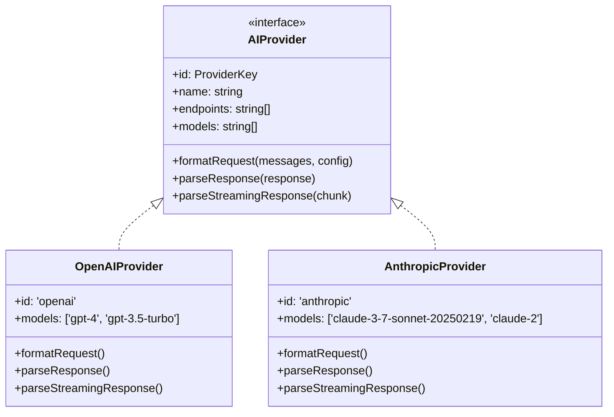
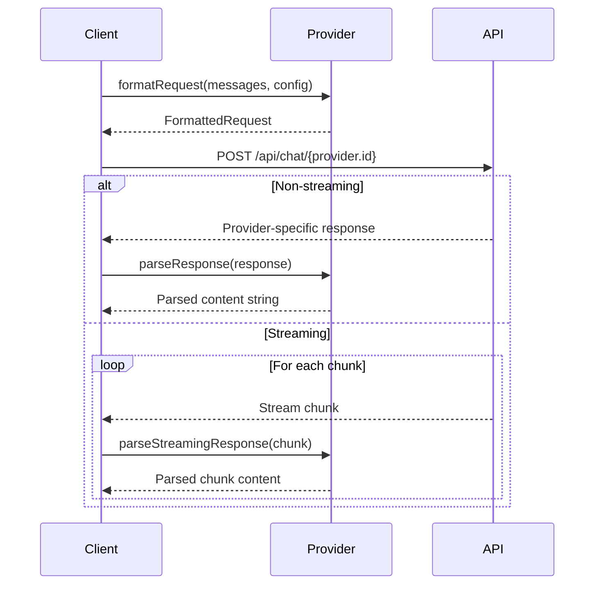
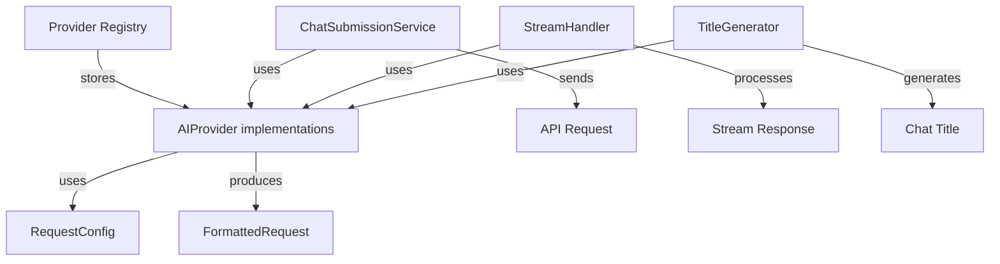

# AI Provider Architecture Analysis

## 1. Core Structures

### Provider Types and Interfaces

```typescript
type ProviderKey = 'openai' | 'anthropic';

interface AIProvider {
  id: ProviderKey;
  name: string;
  endpoints: string[];
  models: string[];
  formatRequest: (messages: MessageInterface[], config: RequestConfig) => FormattedRequest;
  parseResponse: (response: any) => string;
  parseStreamingResponse: (chunk: any) => string;
}
```

### Configuration Interfaces

```typescript
interface ProviderConfig {
  id: ProviderKey;
  name: string;
  defaultModel: string;
  endpoints: string[];
  models: ProviderModel[];
}

interface RequestConfig {
  model: string;
  max_tokens: number;
  temperature: number;
  top_p: number;
  stream: boolean;
  thinking?: {
    type: 'enabled';
    budget_tokens: number;
  };
}

interface FormattedRequest {
  messages: any[]; // Provider-specific message format
  model: string;
  max_tokens: number;
  temperature: number;
  top_p: number;
  stream: boolean;
  [key: string]: any; // Additional provider-specific parameters
}
```

## 2. Provider Implementation Structure



## 3. Request/Response Flow



## 4. System Relationships



## 5. Key Architectural Components

### Provider Architecture
- Each provider implements the `AIProvider` interface
- Providers are responsible for their own request/response formatting
- Common configuration structure with provider-specific extensions
- Centralized provider registry for easy access

### Request/Response Handling
- Unified `RequestConfig` interface for all providers
- Provider-specific request formatting
- Streaming and non-streaming support
- Standardized response parsing

### Integration Points
- `ChatSubmissionService`: Main service for handling chat submissions
- `StreamHandler`: Manages streaming responses
- `TitleGenerator`: Uses providers for chat title generation

### Configuration Management
- Provider-specific model lists
- Default configurations per provider
- Endpoint management
- Error handling and validation

### Implementation Details
- OpenAI focuses on completion-based responses
- Anthropic includes additional thinking mode support
- Both providers support streaming with different formats
- Standardized error handling across providers

## 6. Extension Points

To add a new provider:

1. Implement the `AIProvider` interface
2. Add provider configuration to the registry
3. Implement provider-specific request/response formatting
4. Add provider-specific error handling
5. Update type definitions to include new provider

## 7. Best Practices

1. Always use type-safe provider implementations
2. Handle provider-specific error cases
3. Implement proper stream cleanup
4. Validate configurations before requests
5. Use provider registry for provider access