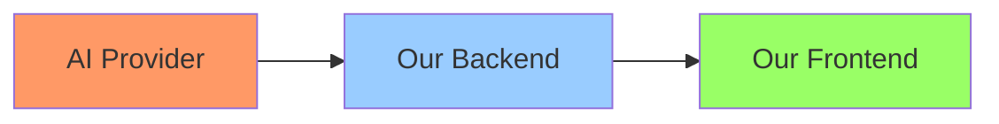

## How SSE is used in our code

Let me explain this in simpler terms:


1) **Is this protocol common?**
   Yes, Server-Sent Events (SSE) is a standard web protocol, like HTTP. It's specifically designed for servers to push data to browsers in real-time. Common uses include:
- Live chat applications
- Social media feeds
- Stock market tickers
- Any app needing real-time updates

The format is always the same:
```
data: your data here

data: more data here
```

2) **What data does this code handle?**

Let's look at the flow:



When you send a chat message:

1. **AI Provider Level** (OpenAI/Anthropic):
```typescript
// Example from OpenAI
const stream = await openai.chat.completions.create({
  messages: [...],
  stream: true  // This tells OpenAI to stream the response
});
```

2. **Our Backend Level** (`api/chat/openai.ts` or `api/chat/anthropic.ts`):
```typescript
// We receive AI provider's stream and forward it to frontend
res.write(`data: ${JSON.stringify(chunk)}\n\n`);
```

3. **Our Frontend Level** (`src/api/helper.ts`):
```typescript
// This is where parseEventSource comes in
export const parseEventSource = (raw: string): any[] => {
  const result: any[] = [];
  // Example raw data:
  // data: {"content": "Hello"}
  // data: {"content": "World"}
  // data: [DONE]

  // Converts it to:
  // [
  //   { content: "Hello" },
  //   { content: "World" },
  //   "[DONE]"
  // ]
  ...
};
```

So to answer your second question: `parseEventSource` handles the data coming from our backend, which is forwarding the AI provider's response. It's like a translator that takes the raw SSE format and turns it into something our frontend code can easily use.

A real example:

1. User types: "What is JavaScript?"
2. AI starts responding: "JavaScript is a programming..."
3. The data flows like this:
```
AI Provider -> Our Backend -> SSE -> parseEventSource -> User sees response
```

Each piece of the response comes as a separate "chunk", and `parseEventSource` helps us piece them together smoothly so the user sees the response being typed out in real-time.

Does this help explain it better? Let me know if you need any part clarified further!

## What protocol does OpenAI and Anthropic uses to send stream to our server

Both OpenAI and Anthropic use HTTP streaming with chunked transfer encoding to send data to our server. However, there are some differences in how each provider implements their streaming:

1. **OpenAI** (`api/chat/openai.ts`):
````typescript path=api/chat/openai.ts mode=EXCERPT
const streamResponse = await openai.chat.completions.create({
  ...chatConfig,
  messages,
  model: chatConfig.model || 'gpt-3.5-turbo',
  stream: true,
});

for await (const part of streamResponse) {
  res.write(`data: ${JSON.stringify(part)}\n\n`);
}
````

2. **Anthropic** (`api/chat/anthropic.ts`):
````typescript path=api/chat/anthropic.ts mode=EXCERPT
const stream = await anthropic.messages.create({
  messages: formattedMessages,
  model: chatConfig.model,
  max_tokens: chatConfig.max_tokens,
  temperature: chatConfig.temperature,
  stream: true,
});

for await (const chunk of stream) {
  if (chunk.type === 'content_block_delta') {
    res.write(`data: ${JSON.stringify({
      type: 'content_block_delta',
      delta: chunk.delta,
    })}\n\n`);
  }
  // ... handling other chunk types
}
````

Key differences:
1. **OpenAI** sends simpler chunks with just content deltas
2. **Anthropic** sends more detailed chunks with different types (message_start, content_block_delta, etc.)

The basic flow is:
```
HTTP Request (with stream=true)
↓
Provider starts streaming chunks
↓
Our server receives chunks
↓
Our server converts chunks to SSE format
↓
Frontend receives SSE events
```

Think of it like watching a YouTube video:
- Instead of downloading the whole video at once
- You get small pieces (chunks) that play as they arrive
- The difference is we're getting text instead of video frames

Both providers use HTTP/1.1 chunked transfer encoding, which is a standard way to send data in pieces without knowing the total size upfront.
