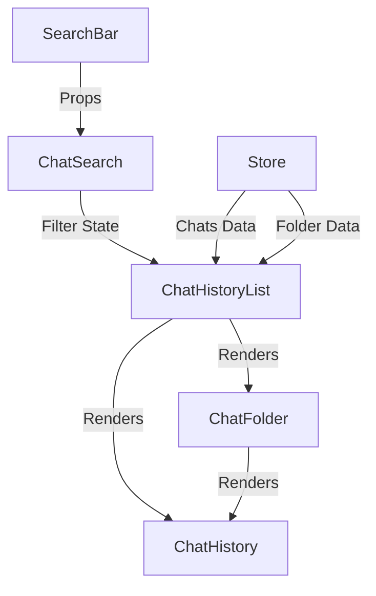
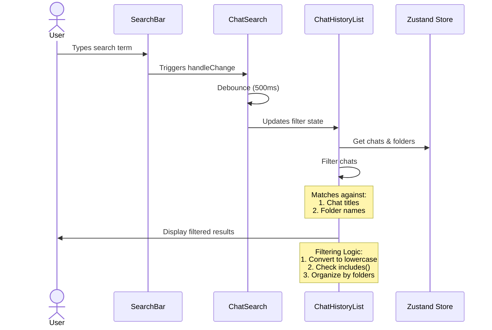

# Chat Search Feature Documentation

## Overview
The search feature allows users to filter chat history by matching chat titles and folder names. The search is case-insensitive and updates in real-time with debouncing.

## File Structure
```
src/
├── components/
│   ├── Menu/
│   │   ├── ChatSearch.tsx       # Search wrapper with debouncing
│   │   ├── ChatHistoryList.tsx  # Search filtering implementation
│   │   └── ChatFolder.tsx       # Folder rendering component
│   └── SearchBar/
│       └── SearchBar.tsx        # Generic search input component
├── types/
│   └── chat.ts                  # Search-related interfaces
└── store/
    └── store.ts                # Global state management
```

## Interfaces and Contracts

### Search Components
```typescript
// SearchBar.tsx
interface SearchBarProps {
  value: string;
  handleChange: React.ChangeEventHandler<HTMLInputElement>;
  className?: React.HTMLAttributes<HTMLDivElement>['className'];
  disabled?: boolean;
}

// ChatSearch.tsx
interface ChatSearchProps {
  filter: string;
  setFilter: React.Dispatch<React.SetStateAction<string>>;
}
```

### Chat History Types
```typescript
// types/chat.ts
interface ChatHistoryInterface {
  title: string;
  index: number;
  id: string;
}

interface ChatHistoryFolderInterface {
  [folderId: string]: ChatHistoryInterface[];
}

interface ChatInterface {
  id: string;
  title: string;
  folder?: string;
  messages: MessageInterface[];
  config: ChatConfig;
  titleSet: boolean;
  timestamp?: number;
}

interface Folder {
  id: string;
  name: string;
  expanded: boolean;
  order: number;
  color?: string;
}
```

## Component Relationships



## Search Flow Sequence



## Implementation Details

1. **Search Input (SearchBar.tsx)**
   - Generic input component
   - Handles basic input changes
   - Supports disabled state
   - i18n support for placeholder

2. **Search Wrapper (ChatSearch.tsx)**
   - Implements debouncing (500ms)
   - Manages local filter state
   - Updates parent component state

3. **Search Filtering (ChatHistoryList.tsx)**
   - Case-insensitive matching
   - Filters based on:
     - Chat titles
     - Folder names
   - Maintains folder structure in results
   - Separates results into:
     - Folder-organized chats
     - Non-folder chats

4. **State Management**
   - Uses Zustand store
   - Persists chat and folder data
   - Maintains current chat index

## Usage Example

```typescript
// Example of filtering logic
const filterChats = (chats: ChatInterface[], filter: string) => {
  const _filterLowerCase = filter.toLowerCase();
  return chats.filter(chat => {
    const _chatTitle = chat.title.toLowerCase();
    const _chatFolderName = chat.folder && folders[chat.folder]
      ? folders[chat.folder].name.toLowerCase()
      : '';
    
    return _chatTitle.includes(_filterLowerCase) || 
           _chatFolderName.includes(_filterLowerCase);
  });
};
```