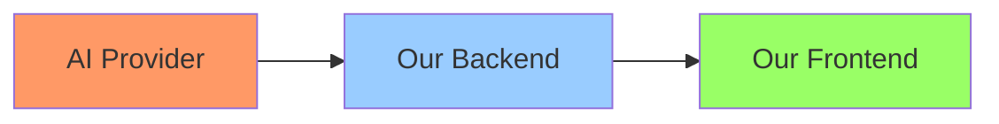

## How SSE is used in our code

Let me explain this in simpler terms:


1) **Is this protocol common?**
   Yes, Server-Sent Events (SSE) is a standard web protocol, like HTTP. It's specifically designed for servers to push data to browsers in real-time. Common uses include:
- Live chat applications
- Social media feeds
- Stock market tickers
- Any app needing real-time updates

The format is always the same:
```
data: your data here

data: more data here
```

2) **What data does this code handle?**

Let's look at the flow:



When you send a chat message:

1. **AI Provider Level** (OpenAI/Anthropic):
```typescript
// Example from OpenAI
const stream = await openai.chat.completions.create({
  messages: [...],
  stream: true  // This tells OpenAI to stream the response
});
```

2. **Our Backend Level** (`api/chat/openai.ts` or `api/chat/anthropic.ts`):
```typescript
// We receive AI provider's stream and forward it to frontend
res.write(`data: ${JSON.stringify(chunk)}\n\n`);
```

3. **Our Frontend Level** (`src/api/helper.ts`):
```typescript
// This is where parseEventSource comes in
export const parseEventSource = (raw: string): any[] => {
  const result: any[] = [];
  // Example raw data:
  // data: {"content": "Hello"}
  // data: {"content": "World"}
  // data: [DONE]

  // Converts it to:
  // [
  //   { content: "Hello" },
  //   { content: "World" },
  //   "[DONE]"
  // ]
  ...
};
```

So to answer your second question: `parseEventSource` handles the data coming from our backend, which is forwarding the AI provider's response. It's like a translator that takes the raw SSE format and turns it into something our frontend code can easily use.

A real example:

1. User types: "What is JavaScript?"
2. AI starts responding: "JavaScript is a programming..."
3. The data flows like this:
```
AI Provider -> Our Backend -> SSE -> parseEventSource -> User sees response
```

Each piece of the response comes as a separate "chunk", and `parseEventSource` helps us piece them together smoothly so the user sees the response being typed out in real-time.

Does this help explain it better? Let me know if you need any part clarified further!

## What protocol does OpenAI and Anthropic uses to send stream to our server

Both OpenAI and Anthropic use HTTP streaming with chunked transfer encoding to send data to our server. However, there are some differences in how each provider implements their streaming:

1. **OpenAI** (`api/chat/openai.ts`):
````typescript path=api/chat/openai.ts mode=EXCERPT
const streamResponse = await openai.chat.completions.create({
  ...chatConfig,
  messages,
  model: chatConfig.model || 'gpt-3.5-turbo',
  stream: true,
});

for await (const part of streamResponse) {
  res.write(`data: ${JSON.stringify(part)}\n\n`);
}
````

2. **Anthropic** (`api/chat/anthropic.ts`):
````typescript path=api/chat/anthropic.ts mode=EXCERPT
const stream = await anthropic.messages.create({
  messages: formattedMessages,
  model: chatConfig.model,
  max_tokens: chatConfig.max_tokens,
  temperature: chatConfig.temperature,
  stream: true,
});

for await (const chunk of stream) {
  if (chunk.type === 'content_block_delta') {
    res.write(`data: ${JSON.stringify({
      type: 'content_block_delta',
      delta: chunk.delta,
    })}\n\n`);
  }
  // ... handling other chunk types
}
````

Key differences:
1. **OpenAI** sends simpler chunks with just content deltas
2. **Anthropic** sends more detailed chunks with different types (message_start, content_block_delta, etc.)

The basic flow is:
```
HTTP Request (with stream=true)
↓
Provider starts streaming chunks
↓
Our server receives chunks
↓
Our server converts chunks to SSE format
↓
Frontend receives SSE events
```

# Technical Motivations

## Server-Sent Events (SSE) Implementation

### Why SSE for AI Response Streaming?

Our system uses Server-Sent Events (SSE) as the primary streaming protocol for AI response delivery. Here are the technical motivations behind this choice:

1. **Architectural Alignment**
   ```
   AI Provider -> Our Backend -> Frontend
   ```
   - One-way data flow matches SSE's design
   - Backend acts as transformer between HTTP chunks and SSE
   - Clean separation of concerns in data delivery

2. **Protocol Benefits**
   - Simpler than WebSocket (no handshake required)
   - Built-in reconnection handling
   - Native browser support via `EventSource`
   - Automatic event ordering with IDs
   - Connection health monitoring via heartbeats

3. **AI Provider Integration**
   - Compatible with both OpenAI and Anthropic streaming
   - Easy transformation of provider chunks to SSE format:
   ```typescript
   // Provider chunk -> SSE format
   res.write(`data: ${JSON.stringify(chunk)}\n\n`);
   ```

4. **Standardized Message Format**
   ```
   data: {"content": "Hello"}
   data: {"content": "World"}
   data: [DONE]
   ```
   - Consistent parsing across different providers
   - Easy to extend for new message types
   - Clear stream termination signals

5. **Performance Considerations**
   - Lower overhead than WebSocket
   - No need to maintain bi-directional state
   - Efficient for text-based streaming
   - Browser handles connection management

6. **Developer Experience**
   - Straightforward debugging (plain text format)
   - Easy to implement on both ends
   - Well-documented standard
   - Familiar to frontend developers

7. **Reliability Features**
   - Automatic reconnection by browser
   - Connection health monitoring
   - Clear error handling patterns
   - Resilient to network issues

### Alternative Considerations

While other protocols were considered, SSE proved optimal for our use case:

| Protocol | Why Not Chosen |
|----------|---------------|
| WebSocket | Overkill for one-way streaming, more complex |
| HTTP Polling | Higher latency, more server load |
| Long Polling | More complex implementation, higher overhead |
| Raw HTTP Streaming | Less standardized, no built-in features |

### Future Considerations

The SSE implementation provides good foundation for future enhancements:
- Easy to add new event types
- Can be extended for different AI providers
- Supports metadata in events
- Allows for custom retry logic


## Key Production Techniques
* Chunk Buffering: Always buffer incomplete chunks to handle partial JSON responses.
* Error Resilience: Wrap parsing in try/catch blocks to prevent stream failures.
* Format Detection: Automatically detect response format (SSE vs direct JSON).
* Unified Interface: Use a common interface for all providers to simplify client code.
* Fallback Mechanisms: Implement fallbacks when provider-specific parsing fails.
* Detailed Logging: Log parsing attempts and results for debugging.
* Abort Handling: Properly handle aborted requests to prevent memory leaks.
* Content Validation: Validate extracted content before passing to callbacks.

This architecture provides:
* Clean separation of concerns
* Easy addition of new providers
* Consistent error handling
* Unified streaming interface
* Type safety with TypeScript