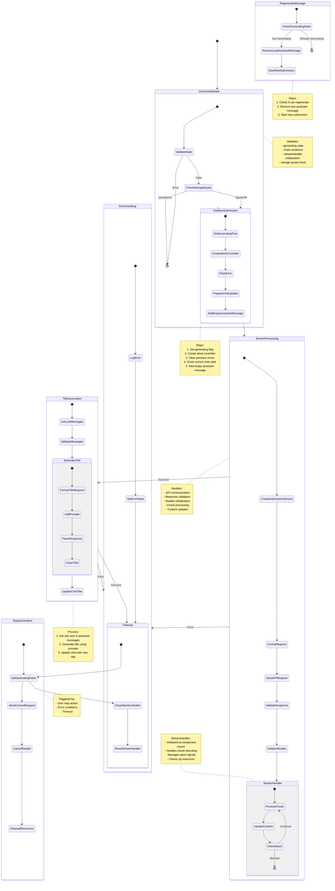

```mermaid
stateDiagram-v2
    [*] --> CheckInitialState
    
    state CheckInitialState {
        [*] --> ValidateState
        ValidateState --> [*]: Error
        ValidateState --> CheckStorageQuota: Valid
        CheckStorageQuota --> [*]: QuotaError
        CheckStorageQuota --> InitializeSubmission: QuotaOK
    }
    
    state InitializeSubmission {
        [*] --> SetGeneratingTrue
        SetGeneratingTrue --> CreateAbortController
        CreateAbortController --> ClearError
        ClearError --> PrepareChatUpdate
        PrepareChatUpdate --> AddEmptyAssistantMessage
    }
    
    state StreamProcessing {
        [*] --> CreateSubmissionService
        CreateSubmissionService --> FormatRequest
        FormatRequest --> SendAPIRequest
        
        state StreamHandler {
            [*] --> ProcessChunk
            ProcessChunk --> UpdateContent
            UpdateContent --> CheckAbort
            CheckAbort --> ProcessChunk: Continue
            CheckAbort --> [*]: Aborted
        }
        
        SendAPIRequest --> ValidateResponse
        ValidateResponse --> InitializeReader
        InitializeReader --> StreamHandler
    }
    
    state TitleGeneration {
        [*] --> GetLastMessages
        GetLastMessages --> ValidateMessages
        
        state GenerateTitle {
            [*] --> FormatTitleRequest
            FormatTitleRequest --> CallProvider
            CallProvider --> ParseResponse
            ParseResponse --> CleanTitle
        }
        
        ValidateMessages --> GenerateTitle
        GenerateTitle --> UpdateChatTitle
    }
    
    state Cleanup {
        [*] --> SetGeneratingFalse
        SetGeneratingFalse --> ClearAbortController
        ClearAbortController --> ResetStreamHandler
    }
    
    state ErrorHandling {
        [*] --> LogError
        LogError --> SetErrorState
        SetErrorState --> Cleanup
    }
    
    CheckInitialState --> InitializeSubmission
    InitializeSubmission --> StreamProcessing
    StreamProcessing --> TitleGeneration: Success
    StreamProcessing --> ErrorHandling: Error
    TitleGeneration --> Cleanup: Success
    TitleGeneration --> ErrorHandling: Error
    
    state StopGeneration {
        [*] --> SetGeneratingFalse
        SetGeneratingFalse --> AbortCurrentRequest
        AbortCurrentRequest --> CancelReader
        CancelReader --> CleanupResources
    }
    
    state RegenerateMessage {
        [*] --> CheckGeneratingState
        CheckGeneratingState --> RemoveLastAssistantMessage: Not Generating
        RemoveLastAssistantMessage --> StartNewSubmission
        CheckGeneratingState --> [*]: Already Generating
    }

note right of CheckInitialState
    Validates:
    - generating state
    - chats existence
    - streamHandler initialization
    - storage quota check
end note

note right of InitializeSubmission
    Steps:
    1. Set generating flag
    2. Create abort controller
    3. Clear previous errors
    4. Clone current chat state
    5. Add empty assistant message
end note

note right of StreamProcessing
    Handles:
    - API communication
    - Response validation
    - Reader initialization
    - Chunk processing
    - Content updates
end note

note right of TitleGeneration
    Process:
    1. Get last user & assistant messages
    2. Generate title using provider
    3. Update chat with new title
end note

note right of StopGeneration
    Triggered by:
    - User stop action
    - Error conditions
    - Timeout
end note

note right of RegenerateMessage
    Steps:
    1. Check if can regenerate
    2. Remove last assistant message
    3. Start new submission
end note

note left of StreamHandler
    StreamHandler:
    - Initialized at component mount
    - Handles chunk decoding
    - Manages abort signals
    - Cleans up resources
end note

```
