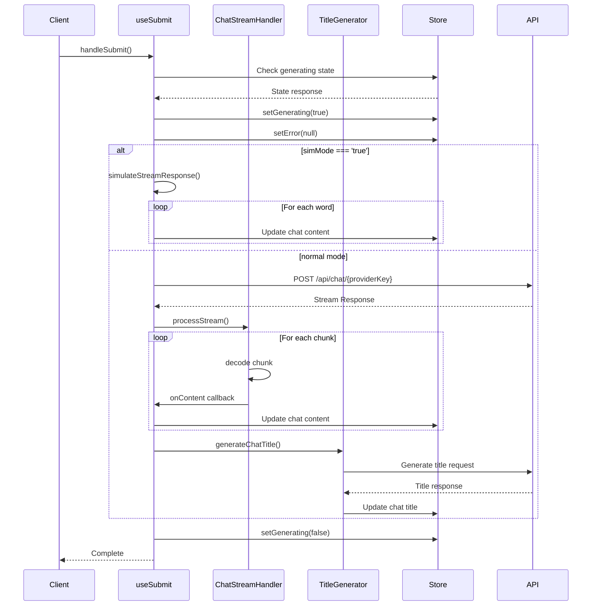
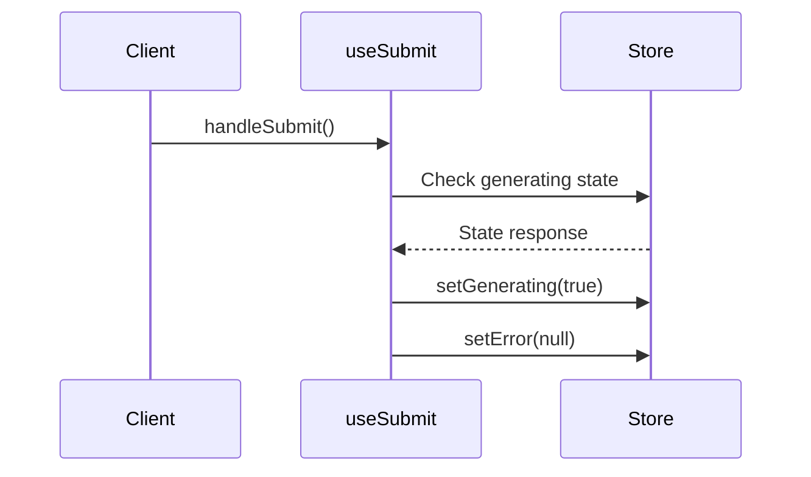
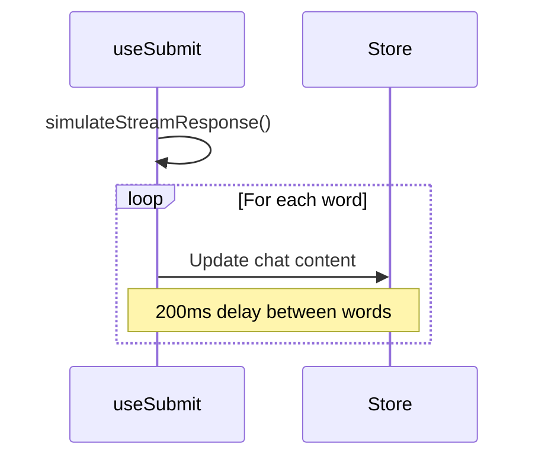
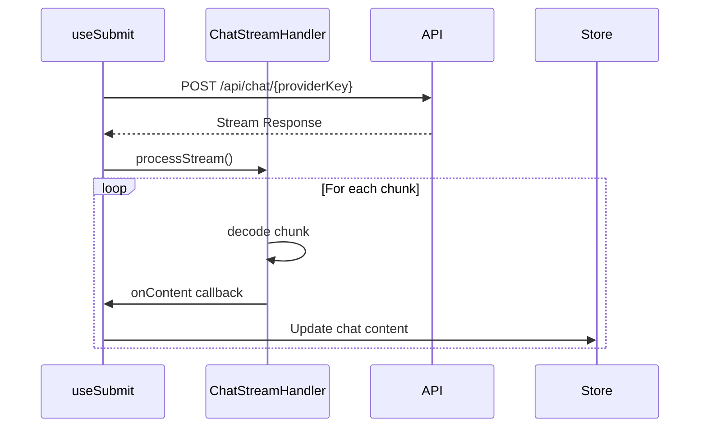
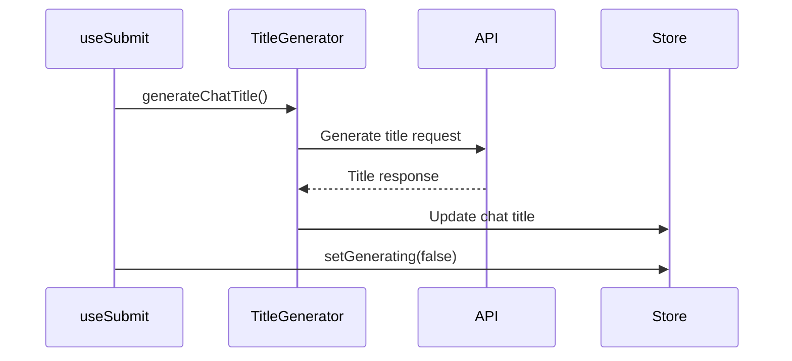

```mermaid
sequenceDiagram
    participant Client
    participant useSubmit
    participant ChatStreamHandler
    participant TitleGenerator
    participant Store
    participant API

    Client->>useSubmit: handleSubmit()
    
    useSubmit->>Store: Check generating state
    Store-->>useSubmit: State response
    
    useSubmit->>Store: setGenerating(true)
    useSubmit->>Store: setError(null)
    
    alt simMode === 'true'
        useSubmit->>useSubmit: simulateStreamResponse()
        loop For each word
            useSubmit->>Store: Update chat content
        end
    else normal mode
        useSubmit->>API: POST /api/chat/{providerKey}
        
        API-->>useSubmit: Stream Response
        useSubmit->>ChatStreamHandler: processStream()
        
        loop For each chunk
            ChatStreamHandler->>ChatStreamHandler: decode chunk
            ChatStreamHandler->>useSubmit: onContent callback
            useSubmit->>Store: Update chat content
        end
        
        useSubmit->>TitleGenerator: generateChatTitle()
        TitleGenerator->>API: Generate title request
        API-->>TitleGenerator: Title response
        TitleGenerator->>Store: Update chat title
    end
    
    useSubmit->>Store: setGenerating(false)
    useSubmit-->>Client: Complete
```

```mermaid
sequenceDiagram
    participant Client
    participant useSubmit
    participant Store

    Client->>useSubmit: handleSubmit()
    useSubmit->>Store: Check generating state
    Store-->>useSubmit: State response
    useSubmit->>Store: setGenerating(true)
    useSubmit->>Store: setError(null)
```

```mermaid
sequenceDiagram
    participant useSubmit
    participant Store

    useSubmit->>useSubmit: simulateStreamResponse()
    loop For each word
        useSubmit->>Store: Update chat content
        Note over useSubmit,Store: 200ms delay between words
    end
```

```mermaid

sequenceDiagram
    participant useSubmit
    participant ChatStreamHandler
    participant API
    participant Store

    useSubmit->>API: POST /api/chat/{providerKey}
    API-->>useSubmit: Stream Response
    useSubmit->>ChatStreamHandler: processStream()
    
    loop For each chunk
        ChatStreamHandler->>ChatStreamHandler: decode chunk
        ChatStreamHandler->>useSubmit: onContent callback
        useSubmit->>Store: Update chat content
    end
```

```mermaid
sequenceDiagram
    participant useSubmit
    participant TitleGenerator
    participant API
    participant Store

    useSubmit->>TitleGenerator: generateChatTitle()
    TitleGenerator->>API: Generate title request
    API-->>TitleGenerator: Title response
    TitleGenerator->>Store: Update chat title
    useSubmit->>Store: setGenerating(false)
```