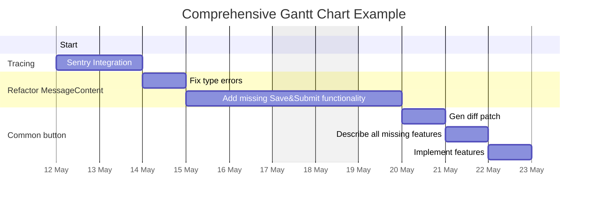

# Project Timeline Comparison

Start: 2025-05-05
Today: 2025-05-12
## Planned Timeline

```mermaid
gantt
    title Comprehensive Gantt Chart Example
    dateFormat  YYYY-MM-DD
    axisFormat  %d %b
    todayMarker on
    excludes weekends
    tickInterval 1day

    Start                 :active, start, 2025-05-12, 0d
    
    section Tracing
    Sentry Integration    :sen1, after start, 2d
    
    section Refactor MessageContent
    Fix type errors :ref0, after sen1, 1d    
    Add missing Save&Submit functionality :ref1, after ref0, 3d
    
    section Common button
    Gen diff patch  :but1, after ref1, 1d
    Describe all missing features :but2, after but1, 1d 
    Implement features :but3, after but2, 1d
    

```
