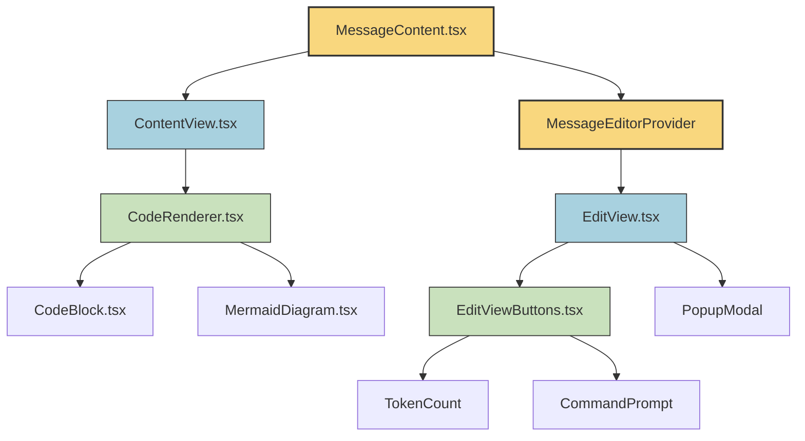
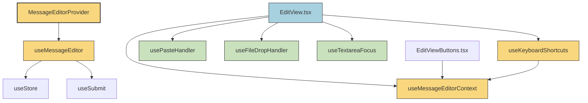
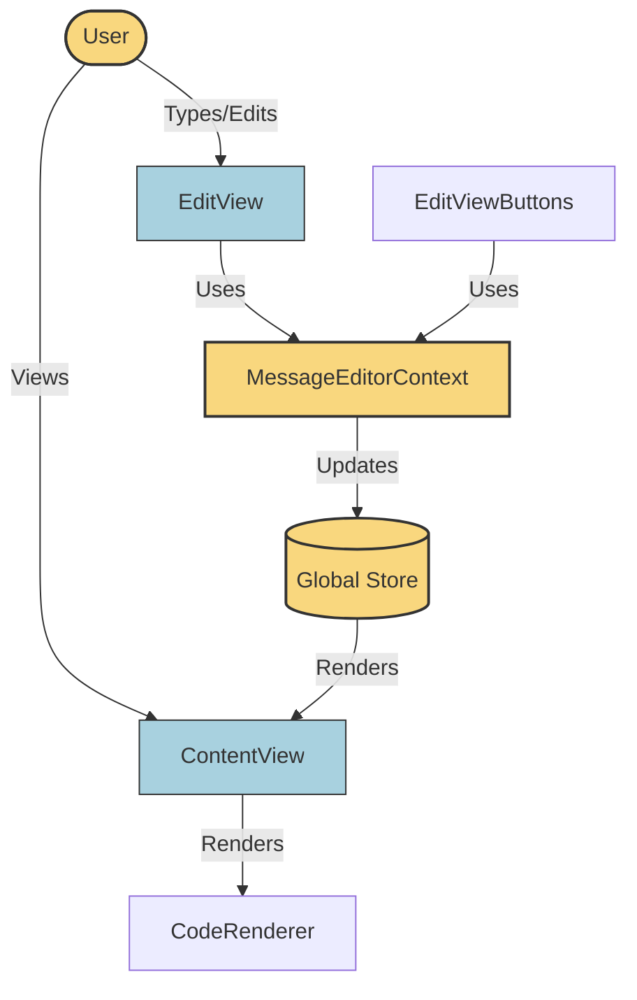
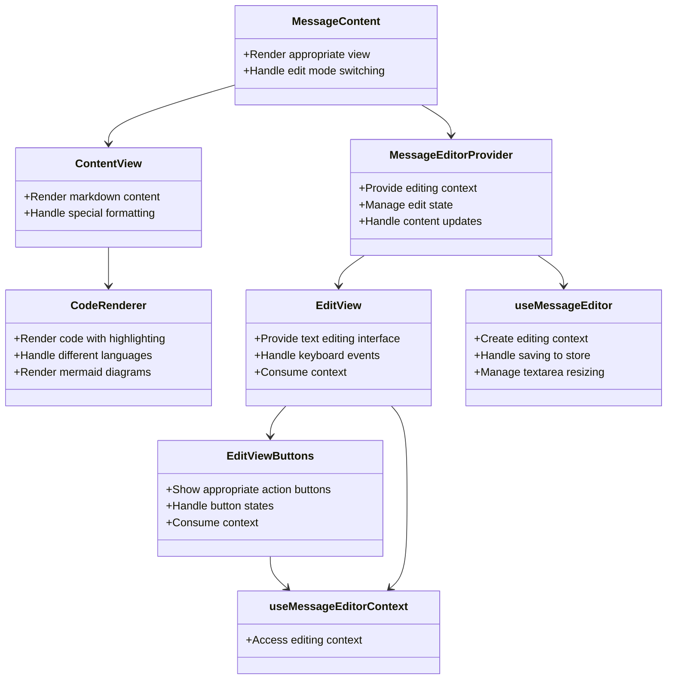

# Component Specifications and Contracts

## 1. CodeBlock Components

### CodeBlock.tsx ✅
**Interface:**
```typescript
interface CodeBlockProps {
  lang: string;
  codeChildren: React.ReactNode;
}
```

**Contract:**
- GIVEN a language and code content
- WHEN the component is rendered
- THEN it should display the code with proper syntax highlighting
- AND show the language name in the header

**Implementation Status:** Complete

### MermaidDiagram.tsx
**Interface:**
```typescript
interface MermaidDiagramProps {
  content: string;
}
```

**Contract:**
- GIVEN a string containing valid Mermaid diagram syntax
- WHEN the component is rendered
- THEN it should parse and display the diagram visually
- AND handle loading states appropriately

### CodeRenderer.tsx
**Interface:**
```typescript
// Uses CodeProps from react-markdown
interface CodeProps {
  inline?: boolean;
  className?: string;
  children: React.ReactNode;
}
```

**Contract:**
- GIVEN code content with optional language information
- WHEN the component is rendered
- THEN it should:
  - Render inline code if inline=true
  - Render a MermaidDiagram if language is "mermaid"
  - Otherwise render a CodeBlock with appropriate language

## 2. View Mode Components

### ContentView.tsx
**Interface:**
```typescript
interface ContentViewProps {
  content: string;
}
```

**Contract:**
- GIVEN a string of markdown content
- WHEN the component is rendered
- THEN it should parse and display the markdown as formatted HTML
- AND handle special elements like code blocks, math, and tables
- AND ensure links open in new tabs

## 3. Edit Mode Components

### MessageEditorContext.tsx
**Interface:**
```typescript
interface MessageEditorContextType {
  // State
  editContent: string;
  isModalOpen: boolean;
  isEditing: boolean;
  
  // Setters
  setEditContent: React.Dispatch<React.SetStateAction<string>>;
  setIsModalOpen: React.Dispatch<React.SetStateAction<boolean>>;
  setIsEdit: React.Dispatch<React.SetStateAction<boolean>>;
  
  // Refs
  textareaRef: React.RefObject<HTMLTextAreaElement>;
  
  // Actions
  handleSave: () => void;
  handleSaveAndSubmit: () => Promise<void>;
  resetTextAreaHeight: () => void;
  
  // Metadata
  messageIndex: number;
  isComposer: boolean;
  focusLine?: number | null;
}

interface MessageEditorProviderProps {
  children: React.ReactNode;
  initialContent: string;
  messageIndex: number;
  isComposer: boolean;
  setIsEdit: React.Dispatch<React.SetStateAction<boolean>>;
  setIsEditing: React.Dispatch<React.SetStateAction<boolean>>;
  focusLine?: number | null;
}
```

**Contract:**
- GIVEN initial message content and editing context
- WHEN the provider is rendered
- THEN it should:
  - Create and manage all edit-related state
  - Provide methods for saving and submitting content
  - Make all state and methods available via context
  - Handle cleanup on unmount

### EditViewButtons.tsx
**Interface:**
```typescript
// No props needed - uses context
interface EditViewButtonsProps {
  // Optional override props
  customSaveHandler?: () => void;
}
```

**Contract:**
- GIVEN the MessageEditorContext
- WHEN the component is rendered
- THEN it should display appropriate buttons based on context:
  - For composer: Save and Submit, Save buttons
  - For message editing: Save, Save and Submit, Cancel buttons
- AND disable buttons when appropriate (during generation or when another message is being edited)
- AND show TokenCount only for composer
- AND show CommandPrompt for both modes

### EditView.tsx
**Interface:**
```typescript
// Minimal props - uses context
interface EditViewProps {
  // Optional override props
  customKeyHandler?: (e: React.KeyboardEvent) => void;
}
```

**Contract:**
- GIVEN the MessageEditorContext
- WHEN the component is rendered
- THEN it should display a textarea with the content
- AND auto-resize the textarea as content changes
- AND handle keyboard shortcuts for saving/submitting
- AND handle paste, drag and drop events
- AND focus the textarea automatically
- AND position cursor at the appropriate line if focusLine is provided
- AND show appropriate buttons via EditViewButtons
- AND show confirmation modal when needed

## 4. Custom Hooks

### useMessageEditor.ts
**Interface:**
```typescript
interface UseMessageEditorProps {
  initialContent: string;
  messageIndex: number;
  isComposer: boolean;
  setIsEdit: React.Dispatch<React.SetStateAction<boolean>>;
  setIsEditing: React.Dispatch<React.SetStateAction<boolean>>;
}

interface UseMessageEditorReturn {
  // All the state and methods needed for the context
  editContent: string;
  setEditContent: React.Dispatch<React.SetStateAction<string>>;
  isModalOpen: boolean;
  setIsModalOpen: React.Dispatch<React.SetStateAction<boolean>>;
  textareaRef: React.RefObject<HTMLTextAreaElement>;
  handleSave: () => void;
  handleSaveAndSubmit: () => Promise<void>;
  resetTextAreaHeight: () => void;
}
```

**Contract:**
- GIVEN message content and editing context
- WHEN the hook is called
- THEN it should:
  - Provide state management for the edited content
  - Provide methods to save changes to the global store
  - Handle different save behaviors for composer vs message editing
  - Manage textarea height adjustments
  - Track editing state in the parent component

### useKeyboardShortcuts.ts
**Interface:**
```typescript
// No props - uses context
interface UseKeyboardShortcutsReturn {
  handleKeyDown: (e: React.KeyboardEvent<HTMLTextAreaElement>) => void;
}
```

**Contract:**
- GIVEN the MessageEditorContext
- WHEN the hook is called
- THEN it should:
  - Provide a keydown handler that implements appropriate shortcuts:
    - Escape to cancel editing (non-composer only)
    - Enter/Shift+Enter/Ctrl+Enter for saving or submitting based on settings
  - Add global keyboard listeners for Escape key
  - Clean up listeners on unmount

## 5. Main Component

### MessageContent.tsx
**Interface:**
```typescript
interface MessageContentProps {
  role: Role;
  content: string;
  messageIndex: number;
  isComposer: boolean;
  isEdit: boolean;
  setIsEdit: React.Dispatch<React.SetStateAction<boolean>>;
  isEditing: boolean;
  setIsEditing: React.Dispatch<React.SetStateAction<boolean>>;
  focusLine?: number | null;
}
```

**Contract:**
- GIVEN message data and editing state
- WHEN the component is rendered
- THEN it should:
  - Render MessageEditorProvider if isEdit=true
  - Render ContentView directly if isEdit=false
  - Make the container focusable when in edit mode
  - Pass necessary props to the provider or ContentView

# Architecture Diagrams

## Component Structure



## Hook Dependencies



## Data Flow



## Component Responsibilities



## Directory Structure

```mermaid
graph TD
    Message[Message/] --> MessageContent[MessageContent.tsx]
    Message --> ViewMode[ViewMode/]
    Message --> EditMode[EditMode/]
    Message --> CodeBlock[CodeBlock/]
    Message --> interfaces[interfaces.ts]
    Message --> context[context/]
    
    context --> MessageEditorContext[MessageEditorContext.tsx]
    context --> MessageEditorProvider[MessageEditorProvider.tsx]
    
    ViewMode --> ContentView[ContentView.tsx]
    
    EditMode --> EditView[EditView.tsx]
    EditMode --> EditViewButtons[EditViewButtons.tsx]
    
    CodeBlock --> CodeBlock.tsx
    CodeBlock --> CodeRenderer[CodeRenderer.tsx]
    CodeBlock --> MermaidDiagram[MermaidDiagram.tsx]
    
    hooks[src/hooks/] --> useMessageEditor[useMessageEditor.ts]
    hooks --> useKeyboardShortcuts[useKeyboardShortcuts.ts]
    hooks --> useTextareaFocus[useTextareaFocus.ts]
    hooks --> usePasteHandler[usePasteHandler.ts]
    hooks --> useFileDropHandler[useFileDropHandler.ts]
    
    style Message fill:#f9d77e,stroke:#333,stroke-width:2px
    style hooks fill:#f9d77e,stroke:#333,stroke-width:2px
    style context fill:#f9d77e,stroke:#333,stroke-width:2px
    style MessageContent fill:#a8d1df,stroke:#333,stroke-width:1px
```



## Refactoring Process

```mermaid
graph LR
    Original[Original MessageContent] --> Phase1[1. Extract Code Components]
    Phase1 --> Phase2[2. Extract View Components]
    Phase2 --> Phase3[3. Extract Edit Components]
    Phase3 --> Phase4[4. Create Custom Hooks]
    Phase4 --> Phase5[5. Create Context]
    Phase5 --> Phase6[6. Refactor Components to Use Context]
    Phase6 --> Phase7[7. Refactor MessageContent]
    
    style Original fill:#f9d77e,stroke:#333,stroke-width:2px
    style Phase7 fill:#a8d1df,stroke:#333,stroke-width:1px
```




